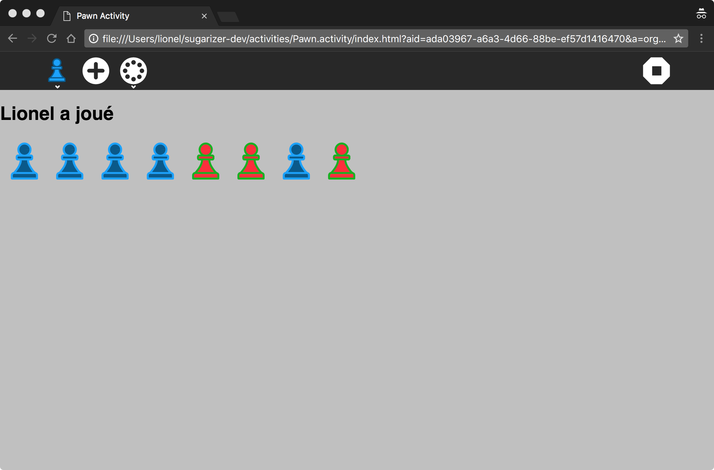

# What is Sugarizer ?

The [Sugar Learning Platform](https://sugarlabs.org/) is a leading learning platform that began in the famous One Laptop Per Child project.
It is used every day by nearly 3 million children around the world.

Sugarizer is a web implementation of the platform and runs on every device - from tiny Raspberry Pi computers to small Android and iOS phones to tablets and to laptops and desktops.

Like Sugar, Sugarizer includes a bunch of pedagogic activities thought for children.

Sugarizer is available as:

* Application: an installable app for every operating system
* Web Application: a web application that runs in modern web browsers

Enjoy the experience and help us reach every child on every device in every country.

# Sugarizer Application

Sugarizer Application is a cross-platform application for installing on any GNU+Linux, Windows, Mac OS X, Android or iOS device.

To run **Sugarizer Application on Android**, download it on [Google Play](https://play.google.com/store/apps/details?id=org.olpc_france.sugarizer), [Amazon Store](http://www.amazon.com/gp/product/B00NKK7PZA) or [F-Droid](https://f-droid.org/repository/browse/?fdid=org.olpc_france.sugarizer).

Sugarizer on Android is also available as a launcher to replace the current launcher of your device so you could launch native Android applications from Sugarizer. You could download this Sugarizer version on [Google Play](https://play.google.com/store/apps/details?id=org.olpc_france.sugarizeros).

You could also build yourself the Sugarizer Application APK using instruction below.

To run **Sugarizer Application on iOS**, download it on [Apple Store](https://itunes.apple.com/us/app/sugarizer/id978495303) or build yourself the Sugarizer Application IPA using instructions below.

To run **Sugarizer Application on GNU Linux/Mac OS/Windows**, download it [here](https://sugarizer.org#desktop).
The Sugarizer desktop application has three possible arguments:

* `--window` to open Sugarizer in a window (instead of fullscreen)
* `--debug` to open Sugarizer with the debug console
* `--init` to remove all existing Journal and settings (all will be lost)

If you're a developer you could also launch Sugarizer desktop application using [electron](https://github.com/electron/electron). First install Node.js and npm on your computer. See [here](http://nodejs.org/) for more information. Then install electron and specific modules for Sugarizer by running:

	npm install

Then launch Sugarizer for GNU Linux with:

	npm start > /dev/null

Or, for Mac OS/Windows, just:

	npm start

You could use Sugarizer desktop arguments using "--" after start. For example:

	npm start -- --window

To run **Sugarizer Application from the Web Browser** (GNU Linux/Mac OS/Windows), you should launch it with a special option to enable access to local files.

For **Chrome**, close ALL running instances of Chrome and re-launch it using the command line:

 	chrome --allow-file-access-from-files  index.html

On Windows, you should launch:

	"C:\Program Files (x86)\Google\Chrome\Application\chrome.exe" --allow-file-access-from-files

On Mac OS, you should launch:

	open -n /Applications/Google\ Chrome.app --args --allow-file-access-from-files

On Linux, you should launch:

	google-chrome-stable --allow-file-access-from-files index.html

> Note: `google-chrome-stable` is the name of Chrome in Ubuntu but it could be different on other distribution, you can get the package-name for Chrome by running `sudo dpkg -l | grep chrome`

For **Firefox**, type in the address bar:

    about:config

Search for the `security.fileuri.strict_origin_policy` parameter and
set it to `false`.

For **Safari** go to the `Safari/Preferences...` menu, under Advanced panel check the *Show develop menu in menu bar* box. Then from the `Develop` menu, select *Disable local file restrictions*.

# Sugarizer Web Application

[Try it now! (try.sugarizer.org)](http://try.sugarizer.org/)

Sugarizer Web App is a web application that runs on any device with a recent version of Chrome, Firefox, Safari or EDGE browser.

As a web application, it does not run offline and requires a permanent network connection to a **Sugarizer Server**.

Sugarizer Server allow deployment of Sugarizer on a local server, for example on a school server, so expose locally Web Application (without Internet access). Sugarizer Server can also be used to provide collaboration features for Sugarizer Application on the network.

To install your own Sugarizer Server, follow instructions on
[Sugarizer Server repository](https://github.com/llaske/sugarizer-server)

# Activities

Sugarizer includes a bunch of pedagogic activities.
All activities could be found in the [activities](activities) directory. Each activity has its own subdirectory. So for example, the *Abecedarium* activity is located in [activities/Abecedarium.activity](activities/Abecedarium.activity)

You could distribute Sugarizer with whatever activities you want.
To do that, you first need to adapt the content of the [activities](activities) directory  to match your wish: removing activities you don't want to distribute and adding in this directory new activities you want to include.

Then you need to update the [activities.json](activities.json) file to reflect your choice.
Here an example of this file:

	[
		{"id": "org.sugarlabs.GearsActivity", "name": "Gears", "version": 6, "directory": "activities/Gears.activity", "icon": "activity/activity-icon.svg", "favorite": true, "activityId": null},
		{"id": "org.sugarlabs.MazeWebActivity", "name": "Maze Web", "version": 2, "directory": "activities/MazeWeb.activity", "icon": "activity/activity-icon.svg", "favorite": true, "activityId": null},
		{"id": "org.olpcfrance.PaintActivity", "name": "Paint", "version": 1, "directory": "activities/Paint.activity", "icon": "activity/activity-icon.svg", "favorite": true, "activityId": null},
		{"id": "org.olpcfrance.TamTamMicro", "name": "TamTam Micro", "version": 1, "directory": "activities/TamTamMicro.activity", "icon": "activity/activity-icon.svg", "favorite": true, "activityId": null},
		{"id": "org.olpcfrance.MemorizeActivity", "name": "Memorize", "version": 1, "directory": "activities/Memorize.activity", "icon": "activity/activity-icon.svg", "favorite": true, "activityId": null},
		{"id": "org.olpg-france.physicsjs", "name": "Physics JS", "version": 1, "directory": "activities/PhysicsJS.activity", "icon": "activity/activity-icon.svg", "favorite": true, "activityId": null},
		{"id": "org.sugarlabs.CalculateActivity", "name": "Calculate", "version": 1, "directory": "activities/Calculate.activity", "icon": "activity/activity-icon.svg", "favorite": true, "activityId": null},
		{"id": "org.sugarlabs.TurtleBlocksJS", "name": "Turtle Blocks JS", "version": 1, "directory": "activities/TurtleBlocksJS.activity", "icon": "activity/activity-icon.svg", "favorite": true, "activityId": null},
		{"id": "org.sugarlabs.Clock", "name": "Clock Web", "version": 1, "directory": "activities/Clock.activity", "icon": "activity/activity-clock.svg", "favorite": true, "activityId": null},
		{"id": "org.olpcfrance.RecordActivity", "name": "Record", "version": 1, "directory": "activities/Record.activity", "icon": "activity/activity-icon.svg", "favorite": true, "activityId": null},
		{"id": "org.olpcfrance.Abecedarium", "name": "Abecedarium", "version": 5, "directory": "activities/Abecedarium.activity", "icon": "activity/activity-icon.svg", "favorite": true, "activityId": null},
		{"id": "org.olpcfrance.KAView", "name": "KA View", "version": 1, "directory": "activities/KAView.activity", "icon": "activity/activity-icon.svg", "favorite": true, "activityId": null},
		{"id": "org.olpcfrance.FoodChain", "name": "FoodChain", "version": 4, "directory": "activities/FoodChain.activity", "icon": "activity/activity-icon.svg", "favorite": true, "activityId": null},
		{"id": "org.olpc-france.labyrinthjs", "name": "Labyrinth JS", "version": 1, "directory": "activities/LabyrinthJS.activity", "icon": "activity/activity-icon.svg", "favorite": true, "activityId": null},
		{"id": "org.olpcfrance.TankOp", "name": "Tank Operation", "version": 1, "directory": "activities/TankOp.activity", "icon": "activity/activity-icon.svg", "favorite": true, "activityId": null},
		{"id": "org.sugarlabs.ChatPrototype", "name": "ChatPrototype", "version": 1, "directory": "activities/ChatPrototype.activity", "icon": "activity/activity-icon.svg", "favorite": true, "activityId": null},
		{"id": "org.olpcfrance.Gridpaint", "name": "Grid Paint", "version": 2, "directory": "activities/Gridpaint.activity", "icon": "activity/activity-icon.svg", "favorite": true, "activityId": null},
		{"id": "org.olpc-france.LOLActivity", "name": "Last One Loses Activity", "version": 1, "directory": "activities/LastOneLoses.activity", "icon": "activity/activity-icon.svg", "favorite": true, "activityId": null},
		{"id": "org.sugarlabs.StopwatchActivity", "name": "Stopwatch", "version": 1, "directory": "activities/Stopwatch.activity", "icon": "activity/activity-icon.svg", "favorite": true, "activityId": null},
		{"id": "org.sugarlabs.Markdown", "name": "Markdown", "version": 3, "directory": "activities/Markdown.activity", "icon": "activity/activity-icon.svg", "favorite": true, "activityId": null},
		{"id": "org.sugarlabs.GTDActivity", "name": "Get Things Done", "version": 1, "directory": "activities/GetThingsDone.activity", "icon": "activity/activity-icon.svg", "favorite": true, "activityId": null},
		{"id": "org.laptop.WelcomeWebActivity", "name": "WelcomeWeb", "version": 1, "directory": "activities/WelcomeWeb.activity", "icon": "activity/welcome-activity.svg", "favorite": true, "activityId": null},
		{"id": "org.vpri.EtoysActivity", "name": "Etoys", "version": 1, "directory": "activities/Etoys.activity", "icon": "activity/activity-etoys.svg", "favorite": false, "activityId": null},
		{"id": "io.cordova.all_in_one_plugin_sample", "name": "Cordova", "version": 1, "directory": "activities/Cordova.activity", "icon": "activity/activity-icon.svg", "favorite": false, "activityId": null},
		{"id": "org.olpcfrance.MediaViewerActivity", "name": "MediaViewer", "version": 1, "directory": "activities/MediaViewer.activity", "icon": "activity/activity-icon.svg", "favorite": false, "activityId": null}
  	]

Each line in this file is one activity. Here is the description of each field:

* **id**: Activity unique ID
* **name**: Display name of the activity
* **version**: Activity version number
* **directory**: Location directory of the activity in Sugarizer
* **icon**: Location of the icon in the activity directory
* **favorite**: true means that the activity is in the favorite view
* **activityId** Reserved for internal use

Remove in this file rows for activities that you want to remove. Add in this file a line for each activity you want to add.

Note than:

1. The [activities/ActivityTemplate](activities/ActivityTemplate) directory does not contain a real activity. It's just a template that you could use to create your own activity.
2. The [activities.json](activities.json) is used only by Sugarizer Application, the Web Application relies on the */api/activities* API that dynamically browse the [activities](activities) directory. By the way, it's a good practice to match the content of the activities.json file and the content of the activities directory.

# Create your own activity

With Sugarizer, it's easy to create an activity with a bunch of HTML and JavaScript.

If you're interested to create your own activity, a full tutorial will guide you between all development steps:

* **Step 1**: create the activity from a template
* **Step 2**: customize icon and content
* **Step 3**: add a toolbar icon
* **Step 4**: handle journal and datastore
* **Step 5**: localize the activity
* **Step 6**: handle multi-user with presence
* **Step 7**: use journal chooser dialog

Let's start [here](docs/tutorial.md).

# Unit testing

To run unit tests for Sugarizer Application, run "file:///PathToYourSugarizerRepo/test/index.html" in your browser.

# Build Application for Android and iOS

Sugarizer Application could be packaged as an Android or iOS application using [Cordova](http://cordova.apache.org/).

A dedicated tool named [Sugarizer APK Builder](https://github.com/llaske/sugarizer-apkbuilder) allow you to create the Android packaging without any Android knowledge.

If you want to build it yourself, see following instructions.

First install Cordova as described [here](http://cordova.apache.org/).

Then create a directory for Sugarizer Cordova and put the content of the git repository in the www directory:

	cordova create sugar-cordova
	cd sugar-cordova
	rm config.xml
	rm -fr www
	git clone https://github.com/llaske/sugarizer.git www

Add the platform you want to add (here Android):

	cordova platform add android

Replace the auto generated config.xml file by the Sugarizer one:

	cp www/config.xml .

Build the package:

	cordova build android

On Android, if you want to generate the Sugarizer OS version, remove the SugarizerOS comment around the `cordova-plugin-sugarizeros` plugin in [config.xml](config.xml) file.

# Reduce package size

The current size of Sugarizer is about 300 Mb. This huge size is related to media content and resources include in two activities:

* **Abecedarium activity**: about 150 Mb
* **Etoys activity**: about 100 Mb

By the way, both activities are able to retrieve the content remotely if its not deployed locally. So, if you want to reduce the Sugarizer package size (specifically for deployment on mobile) you could either remove completely those two activities or just remove the media content of this activities.

To remove activities, just remove both activities directory and update [activities.json](activities.json) file as explain above.

To remove media content for **Abecedarium**, remove directories:

* [activities/Abecedarium.activity/audio/en](activities/Abecedarium.activity/audio/en)
* [activities/Abecedarium.activity/audio/fr](activities/Abecedarium.activity/audio/fr)
* [activities/Abecedarium.activity/audio/es](activities/Abecedarium.activity/audio/es)
* [activities/Abecedarium.activity/images/database](activities/Abecedarium.activity/images/database)

The activity will look for media content on the server referenced in [activities/Abecedarium.activity/config.js](activities/Abecedarium.activity/config.js), by default `http://server.sugarizer.org/activities/Abecedarium.activity/`.

To remove resources for **Etoys**, remove directory [activities/Etoys.activities/resources](activities/Etoys.activities/resources) and replace the value `resources/etoys.image` in [activities/Etoys.activities/index.html](activities/Etoys.activities/index.html) by the remote location of the resources, for example `http://server.sugarizer.org/activities/Etoys.activity/resources/etoys.image`.

# Optimize performance

If you want to optimize JavaScript performance, you could generate an optimized version of Sugarizer with [Grunt](http://gruntjs.com). This optimized version will minimize and reduce size of all JavaScript files.

First ensure than Node.js and npm is installed on your machine. See [here](http://nodejs.org/) for more information.

The [Gruntfile.js](Gruntfile.js) contains tasks settings to build an optimized version of Sugarizer. To do that, ensure first that grunt is installed:

	npm install -g grunt-cli

Then install specific component for Sugarizer by running:

	npm install

Finally launch:

	grunt -v

At the end of the process, the `build` directory will contain the optimized version of each file in a same directory that the initial one, so you could just copy files:

	cp -r build/* .

# Localization

If you're not a developer and you want to translate Sugarizer into your own language, please go to the [Sugarizer translation platform](http://translate.sugarizer.org) where you will be able to do that. If you're a developer, the following paragraphs will explain to you how the Sugarizer localization system works.

Sugarizer use [webL10n](https://github.com/fabi1cazenave/webL10n) localization system by Fabien Cazenave.

Here how to add a new translation. See a video tutorial [here](https://youtu.be/vTPVegrVm5A).

All strings are localized in the [locale.ini](locale.ini) file at the root of the repository.
If you want to add a new translation, copy the whole [en] section at the end of the file and:

* Replace "en" by the [ISO 639-1 code](https://en.wikipedia.org/wiki/List_of_ISO_639-1_codes) of your language. For example, "fr" for French,
* Substitute the right side of the "=" character on each line by the string localized in your language. For example:

		[fr]
		StartNew=Commencer un nouveau
		NameActivity=Activité {{name}}
		RemoveFavorite=Retirer le favori

Warning: Note that text inside {{}} must not be localized. So here, **{{name}}** is not translated.

Sugarizer automatically detects the navigator language. To enable this detection, you need to update the settings.init function in the [lib/settings.js](lib/settings.js) file. Add a test on your language code. For example in French:

	else if (navigatorLanguage.indexOf("fr") != -1)
		this.language = "fr";

Sugarizer settings display a list of all available languages. You need to add your language in this dialog. For this you have to:

* Add a new string in [locale.ini](locale.ini) with the name of your language in English. For example:

		French=French

* Add the same line for all languages/sections in the file. If you're able to do that, translate the right side of the "=" character with the localized string for the name of your language. If you don't know how to translate it, just let the English word. For example:

		French=Français

* Add your string in the [js/dialog.js](dialog.js) file in the create function of the Enyo class Sugar.DialogLanguage. You should give the ISO 639-1 language code and the new string for your language name. For example:

		{code: "fr", icon: null, name: l10n.get("French")},

That's all. Test the result in your browser.

Note that this translation is for Sugarizer only. Each activity could provide its own localization feature.

# How to contribute

As all Open Source software, contributions to this software are welcome.

Read [CONTRIBUTING](CONTRIBUTING.md) to learn more about how to contribute to Sugarizer.

# License

Sugarizer is licensed under the **Apache v2** license.  See [LICENSE](LICENSE) for full license text.  Most Sugarizer activities use this license too but some could use a different license, check the [activities](activities) directory to be sure.

