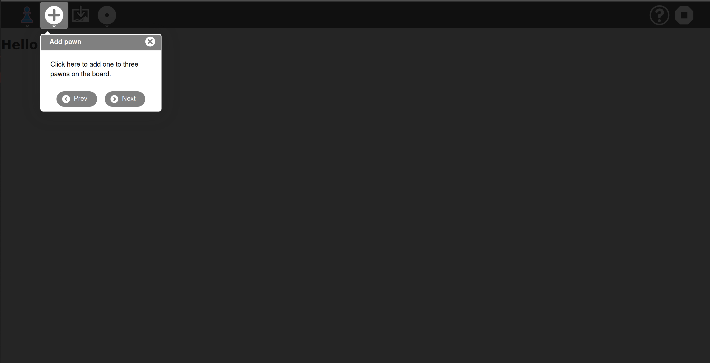

[Go back to tutorial home](tutorial.md)

# Step 9: Integrate a tutorial
*(Estimated time: 15mn)*

Because Sugarizer is a platform dedicated to children, activities should be self-understandable. By the way, it's fair to provide some help to shy users that don't want to click everywhere.

In this tutorial, you'll learn how to easily integrate a tutorial into your Pawn activity.


## What's a tutorial in Sugarizer?

Go to the Sugarizer home view and click on the "?" button to launch the tutorial. Use Next/Prev button to navigate.


As you can see, the tutorial is a set of dialog box that show you the meaning of UI elements by pointing on them.

Let's see how to do the same in our Pawn activity.


## Prepare the UI

First, we're going to prepare the UI of the activity.

Sugarizer users expect to find the help button into the toolbar. It will be our first step to add it.


So, download the help icon `help.svg` [here](../images/help.svg) and copy it in the `icons` directory of your Pawn activity.

Then, as usual, let's add our new button in the toolbar. To do that we will first update the `index.html` by adding the button at the end of the toolbar:
```html
<div id="main-toolbar" class="toolbar">

		...

	<!-- Buttons with class="pull-right" will be right aligned -->
	<button class="toolbutton pull-right" id="stop-button" title="Stop"></button>
	<button class="toolbutton pull-right" id="help-button" title="Tutorial"></button>
</div>
```
Don't forget the `pull-right` class to align it to the right.

We will now associate the icon to this new button. Like in Step 3 of this tutorial, this association should be done in the `css/activity.css` file. Add these lines at the end of the file.
```css
#main-toolbar #help-button {
	background-image: url(../icons/help.svg);
}
```
Let's run the activity to test the result.


The button is here. That's a good start.


## Integrate Bootstrap tour components

Sugarizer relys on the [Bootstrap tour library](http://bootstraptour.com/) to produce the UI for the tutorial. 

**Bootstrap tour** is a set of components - based on the famous [Boostrap](https://getbootstrap.com/) and [jQuery](https://jquery.com/) libraries - dedicated to build interactive tutorial. It could be integrated into web pages that already use Bootstrap/jQuery but is also usable standalone for web pages that don't use them (like in our case).

Let's see how to integrate it in Pawn activity.

First download the bootstrap tour standalone and jQuery JavaScript libraries. You could find the `bootstrap-tour-standalone.min.css` file [here](download/bootstrap-tour-standalone.min.css), the `bootstrap-tour-standalone.min.js` file [here](download/bootstrap-tour-standalone.min.js) and the `jquery.min.js` file [here](download/jquery.min.js).

Copy these files in your Pawn activity. The first file should be copied in the `css` directory and the two others files should be copied in the `lib` directory.

We're now going to reference these files from our `index.html` file. Update the file like that:
```html
...
<link rel="stylesheet" href="css/activity.css">

<link rel="stylesheet" href="css/bootstrap-tour-standalone.min.css">
<script>if (typeof module === 'object') {window.module = module; module = undefined;}</script>
<script src="lib/jquery.min.js"></script>
<script src="lib/bootstrap-tour-standalone.min.js"></script>
<script>if (window.module) module = window.module;</script>

<script data-main="js/loader" src="lib/require.js"></script>
...
```
The main change is to add the link on the CSS file and integrate the libraries into the scripts part. 

Note that we've done script integration around `if (typeof module ...)` and `if (window.module)` testing. It's related to an [incompatibility between Electron and jQuery](https://stackoverflow.com/questions/32621988/electron-jquery-is-not-defined). You don't have to worry about that.


## Display the tutorial

Only a few Javascript lines are needed to display a tutorial with Bootstrap tour. By the way, it's a good practice to separate this specific code in a dedicated file.

So, let's create a new Javascript file `lib/tutorial.js` to handle everything related to the tutorial.

Insert in this file the following code:
```js
define([], function () {
	var tutorial = {};

	tutorial.start = function() {
		var steps = [
			{
				element: "",
				orphan: true,
				placement: "bottom",
				title: "Pawn Activity",
				content: "Welcome into the Pawn activity. This activity is an activity to test Sugarizer development."
			},
			{
				element: "#add-button",
				placement: "bottom",
				title: "Add pawn",
				content: "Click here to add one to three pawns on the board."
			},
			{
				element: "#picture-button",
				title: "Change background",
				content: "Click here to choose a new background for the board."
			}
		];
		var tour = new Tour({steps: steps});
		tour.init();
		tour.start(true);

	};

	return tutorial;
});
```
Since Step 2, you should now be familiar with the structure of this file. It defines a new **require.js** component with a single method `start()`.

The `start` method contains all the stuff to call Bootstrap tour. 

We've first defined an array with steps (i.e. dialogs) for the tutorial. Here we've chosen a dialog box to present the activity, then two dialog box to explain the role of "Add" and "Insert Image" buttons.

Then we've created the `Tour` object, exposed by the Bootstrap tour library. Finally, we've called the `init()` and `start()` method on this object to display the tutorial.

Really easy, isn't it?

Can't wait to test it! 

But we need first to integrate our new components in the main source code for our Pawn activity. Once again, we will update the dependencies list of libraries at the first line of the `js/activity.js` file.
```js
define(["sugar-web/activity/activity", ... ,"pawnpalette","tutorial"], function (activity, ... , pawnpalette, tutorial) {
```
This time you need to add the `tutorial` library created before. Add the string `"tutorial"` at the end of dependencies array and declare a new `tutorial` variable at the end of the function declaration.

Then we need to add an event listener to handle click on our new help button:
```js
// Launch tutorial
document.getElementById("help-button").addEventListener('click', function(e) {
	tutorial.start();
});
```
That's all. Now launch the activity and click on the help button.


Hurrah! It works!


## Sugarize the UI

Our tutorial is nice but it don't look like to an usual Sugarizer tutorial. Let's now "Sugarize" the tutorial UI.

A cool feature of Bootstrap tour is that we're able to fully customize the UI by using "templates". A template is a way to provide the exact HTML code that you want to use for the tutorial window.

So we're going to update the call to Bootstrap tour into `lib/tutorial.js` to include a more Sugarizer friendly UI:
```js
var tour = new Tour({
	template: "\
	<div class='popover tour'>\
		<div class='arrow'></div>\
		<h3 class='popover-title tutorial-title'></h3>\
		<div class='popover-content'></div>\
		<div class='popover-navigation' style='display: flex; flex-wrap:wrap; justify-content: center; align-items: center'>\
			<div class='tutorial-prev-icon icon-button' data-role='prev'>\
				<div class='tutorial-prev-icon1 web-activity'>\
					<div class='tutorial-prev-icon2 web-activity-icon'></div>\
					<div class='tutorial-prev-icon3 web-activity-disable'></div>\
				</div>\
				<div class='icon-tutorial-text'>Prev</div>\
			</div>\
			<span data-role='separator' style='margin: 4px'>|</span>\
			<div class='tutorial-next-icon icon-button' data-role='next'>\
				<div class='tutorial-next-icon1 web-activity'>\
					<div class='tutorial-next-icon2 web-activity-icon'></div>\
					<div class='tutorial-next-icon3 web-activity-disable'></div>\
				</div>\
				<div class='icon-tutorial-text'>Next</div>\
			</div>\
			<div class='tutorial-end-icon icon-button' data-role='end'>\
				<div class='tutorial-end-icon1 web-activity'>\
					<div class='tutorial-end-icon2 web-activity-icon'></div>\
					<div class='tutorial-end-icon3 web-activity-disable'></div>\
				</div>\
				<div class='icon-tutorial-text'>End</div>\
			</div>\
		</div>\
	</div>",
	storage: false,
	backdrop: true,
	steps: steps
});
```
We need also to define CSS class used in the template. To do that, add the following lines to the `css/activity.css` file:
```css
.tutorial-title {
	background-color: #808080 !important;
	color: #ffffff !important;
}

.tutorial-prev-icon {
	display: inline-flex;
	width: 90px;
}

.tutorial-prev-icon.icon-button {
	color: white;
}

.tutorial-prev-icon.icon-button.disabled {
	color: black;
}

.tutorial-prev-icon1 {
	margin-left: 6px;
	margin-top: 6px;
}

.tutorial-prev-icon2 {
	background-image: url(../icons/go-left.svg);
	width: 20px;
	height: 20px;
	background-size: 20px 20px;
}

.tutorial-prev-icon3 {
	display: none;
	width: 20px;
	height: 20px;
	background-size: 20px 20px;
	background-color: white;
	margin-top: -20px;
}

.tutorial-next-icon {
	display: inline-flex;
	width: 90px;
}

.tutorial-next-icon.icon-button {
	color: white;
}

.tutorial-next-icon.icon-button.disabled {
	color: black;
}

.tutorial-next-icon1 {
	margin-left: 6px;
	margin-top: 6px;
}

.tutorial-next-icon2 {
	background-image: url(../icons/go-right.svg);
	width: 20px;
	height: 20px;
	background-size: 20px 20px;
}

.tutorial-next-icon3 {
	display: none;
	width: 20px;
	height: 20px;
	background-size: 20px 20px;
	background-color: white;
	margin-top: -20px;
}

.tutorial-end-icon {
	display: inline-flex;
	width: 90px;
}

.tutorial-end-icon.icon-button {
	color: white;
}

.tutorial-end-icon.icon-button.disabled {
	color: black;
}

.tutorial-end-icon1 {
	margin-left: 6px;
	margin-top: 6px;
}

.tutorial-end-icon2 {
	background-image: url(../icons/dialog-cancel.svg);
	width: 20px;
	height: 20px;
	background-size: 20px 20px;
}

.tutorial-end-icon3 {
	display: none;
	width: 20px;
	height: 20px;
	background-size: 20px 20px;
	background-color: white;
	margin-top: -20px;
}

.icon-tutorial-text {
	margin-top: 7px;
	padding-left: 4px;
	padding-right: 38px;
	display: inline-block;
}

.web-activity-icon {
	background-repeat: no-repeat;
	background-position: center;
	padding: 2px;
}

.icon-button {
	border-radius: 22px;
	margin-top: 5px;
	height: 35px;
	background-color: #808080;
	border: 2px solid #808080;
}
```
Finally we need to integrate icons used by Sugarizer buttons. So download icons `go-left.svg` [here](../images/go-left.svg), `go-right.svg` [here](../images/go-right.svg), `dialog-cancel.svg` [here](../images/dialog-cancel.svg) and copy them in the `icons` directory.

Launch again the activity.



It's much better now!


## Localize the tutorial

We're almost done but we must add a final step to our tutorial. As we've mentioned in Step 5, your activity should be localized to automatically adapt to the user language. The same is true for our tutorial.

So let's first prepare text to localize. We need to translate title and content for each dialog box and text for buttons. As we've learned during the Step 5, update your `locale.ini` file to define new resource strings:
```
TutoPrev=Prev
TutoNext=Next
TutoEnd=End
TutoExplainTitle=Pawn Activity
TutoExplainContent=Welcome into the Pawn activity. This activity is an activity to test Sugarizer development.
TutoAddTitle=Add pawn
TutoAddContent=Click here to add one to three pawns on the board.
TutoBackgroundTitle=Change background
TutoBackgroundContent=Click here to choose a new background for the board.
```
You should add these strings in the `*` section and give their translations for `en`, `fr` and `es` sections.

Now you need to reference the [webL10n](https://github.com/fabi1cazenave/webL10n) JavaScript library into our `lib/tutorial.js`. Update the "define" line like this:
```js
define(["webL10n"], function (l10n) {
```
We're now able to reference our new resource strings by using call to `l10n.get()` method. First into steps:
```js
var steps = [
	{
		element: "",
		orphan: true,
		placement: "bottom",
		title: l10n.get("TutoExplainTitle"),
		content: l10n.get("TutoExplainContent")
	},
	{
		element: "#add-button",
		placement: "bottom",
		title: l10n.get("TutoAddTitle"),
		content: l10n.get("TutoAddContent")
	},
	{
		element: "#picture-button",
		title: l10n.get("TutoBackgroundTitle"),
		content: l10n.get("TutoBackgroundContent")
	}
];
```
Then into the template to change the text for buttons:
```js
var tour = new Tour({
	template: "\
	<div class='popover tour'>\
		<div class='arrow'></div>\
		<h3 class='popover-title tutorial-title'></h3>\
		<div class='popover-content'></div>\
		<div class='popover-navigation' style='display: flex; flex-wrap:wrap; justify-content: center; align-items: center'>\
			<div class='tutorial-prev-icon icon-button' data-role='prev'>\
				<div class='tutorial-prev-icon1 web-activity'>\
					<div class='tutorial-prev-icon2 web-activity-icon'></div>\
					<div class='tutorial-prev-icon3 web-activity-disable'></div>\
				</div>\
				<div class='icon-tutorial-text'>"+l10n.get("TutoPrev")+"</div>\
			</div>\
			<span data-role='separator' style='margin: 4px'>|</span>\
			<div class='tutorial-next-icon icon-button' data-role='next'>\
				<div class='tutorial-next-icon1 web-activity'>\
					<div class='tutorial-next-icon2 web-activity-icon'></div>\
					<div class='tutorial-next-icon3 web-activity-disable'></div>\
				</div>\
				<div class='icon-tutorial-text'>"+l10n.get("TutoNext")+"</div>\
			</div>\
			<div class='tutorial-end-icon icon-button' data-role='end'>\
				<div class='tutorial-end-icon1 web-activity'>\
					<div class='tutorial-end-icon2 web-activity-icon'></div>\
					<div class='tutorial-end-icon3 web-activity-disable'></div>\
				</div>\
				<div class='icon-tutorial-text'>"+l10n.get("TutoEnd")+"</div>\
			</div>\
		</div>\
	</div>",
	storage: false,
	backdrop: true,
	steps: steps
});
```
It's done.

Switch to French into Sugarizer settings and relaunch the activity:


Congratulation! Your activity has now a tutorial perfectly integrated into Sugarizer environment.

[Go back to tutorial home](tutorial.md)