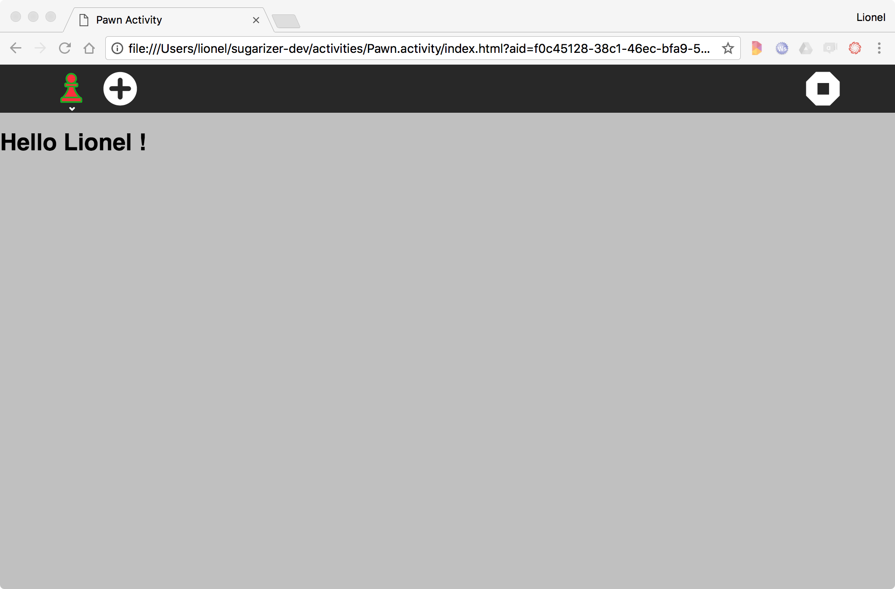
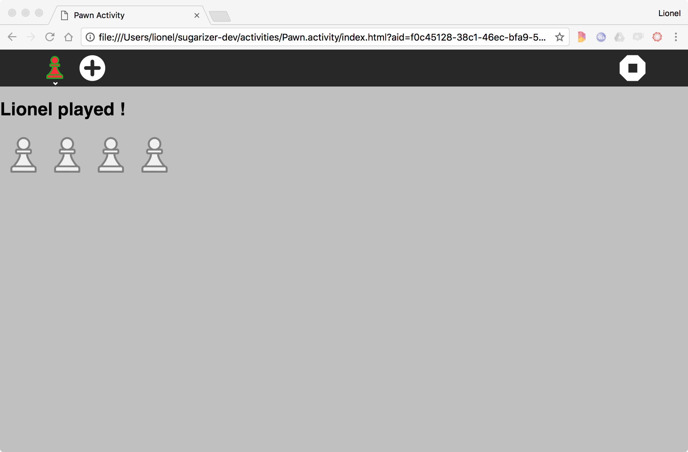
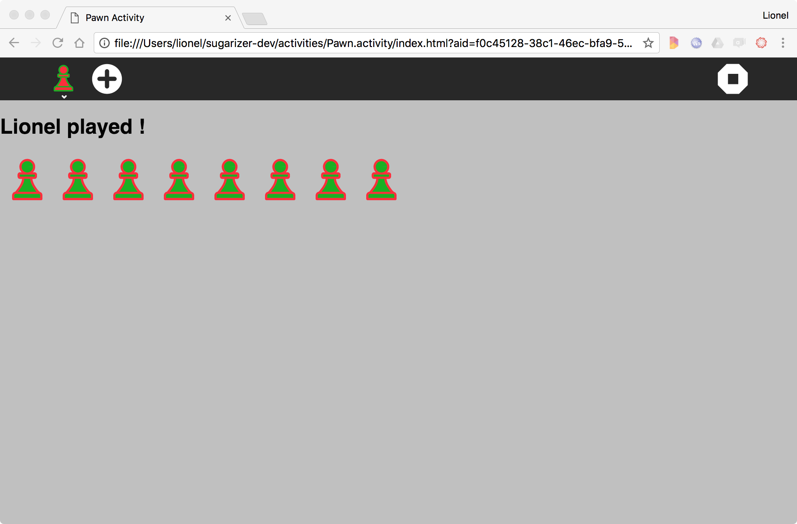

[Go back to tutorial home](tutorial.md)

# Step 3: Add a toolbar button
*(Estimated time: 30mn)*

It's time now to implement the logic of our new activity.

Because the activity is called "Pawn", the idea is to allow the user to play pawns on the board.

In Sugar, the toolbar - the black area at the top of the window - is the place where activities put actions for the user. So we will add a new button in the toolbar to let the user play a new pawn.

## Create a new toolbar button

Here is the icon we will use. It's just a stylized plus sign.


You could download it [here](../images/add.svg). Right-click on it and then save it as a SVG file in `icons/add.svg`.

***Warning***: *The plus sign is white on a transparent background so you will see nothing if you display it on a white background.*

To add this icon in the toolbar, we will first update the `index.html` file for your activity. Look for the sugar-toolbar section in the file. It looks like this:
```html
<sugar-toolbar ref="SugarToolbar">
  <sugar-toolitem id="activity-button"></sugar-toolitem>
  <sugar-toolitem splitbar></sugar-toolitem>

  <!-- Add more buttons here -->
  

  <!-- Toolitems with class="pull-right" will be right aligned -->
  <sugar-toolitem id="stop-button" title="Stop" class="pull-right"></sugar-toolitem>
</sugar-toolbar>
```

The component `js/components/SugarToolbar.js` defines two components: `sugar-toolbar` nad `sugar-toolitem` (buttons).

Let's add our new button. It's just an instance of `sugar-toolitem` component. We give it the value `add-button` for the `id` property. Here is the result:
```html
<sugar-toolbar ref="SugarToolbar">
  <sugar-toolitem id="activity-button"></sugar-toolitem>
  <sugar-toolitem splitbar></sugar-toolitem>

  <!-- Add more buttons here -->
  <sugar-toolitem id="add-button" title="Add Pawn"></sugar-toolitem>

  <!-- Toolitems with class="pull-right" will be right aligned -->
  <sugar-toolitem id="stop-button" title="Stop" class="pull-right"></sugar-toolitem>
</sugar-toolbar>
```

We will now associate the icon to this new button. This association should be done in the `css/activity.css` file. Add these lines at the end of the file.
```css
#main-toolbar #add-button {
	background-image: url(../icons/add.svg);
}
```
Let's run the activity.



The new toolbar button is now here. Click on it. Of course, nothing happens thought there is no logic beside. It's our next step.

## Add the event

To display pawns on the board, we will first update our `index.html` file.

Add a new `div` tag below the one created for the welcome message:
```html
<div id="user">
  <h1>{{ displayText }}</h1>
</div>
<div id="pawns"></div>
```
We give the value `pawns` for the attribute `id` because it will contain all pawns on the board.

To draw the pawn we will reuse our nice pawn icon. So each time there will be a click on the Plus button, we will add a new pawn icon on the board.

Let's update the `js/activity.js` to add this. But first, we will slightly adapt our `getEnvironment` call. We just add a `currentenv` data variable to store the environment to avoid multiple call of the `getEnvironment` method:
```js
data: {
  currentenv: null,
  displayText: ''
},
methods: {
  initialized: function () {
    // Sugarizer initialized
    this.currentenv = this.$refs.SugarActivity.getEnvironment();
    this.displayText = "Hello " + this.currentenv.user.name + "!";	
  },
}
```
Then just after the `initialized`, we will add the following method to handle click event and a new `pawns` array:
```js
data: {
  ...
  pawns: []
},
methods: {
  ...
  onAddClick: function () {
    this.pawns.push(this.currentenv.user.colorvalue);
    this.displayText = this.currentenv.user.name + " played";
  },
}
```

This method adds the colors of the user to the array on click. The method also updates the `displayText` to show who made the move. We will use this pawns array to dynamically render pawns to the screen using `v-for`, like this:
```html
<div id="pawns">
  <div class="pawn" v-for="(pawn, i) in pawns" v-bind:key="i"></div>
</div>
```

Now, call this method using `v-on:click` directive on the add pawn button.
```html
<sugar-toolitem id="add-button" title="Add Pawn" v-on:click="onAddClick"></sugar-toolitem>
```

Make sense? Yes, except that something is missing: the link between the `div` created for the pawn and the pawn icon itself. To do that we have to update the `css/activity.css` file. Add these lines at the end of the file:
```css
.pawn {
	background-image: url(../icons/pawn-icon.svg);
	display: inline-block;
	width: 65px;
	height: 65px;
}
```
It defined a new CSS class named `pawn`, give it few cosmetic properties and specifically our pawn icon as background.

Can't wait to run again our activity:



Wow, it works! Each time we will click on the Plus icon a new pawn will appear.

By the way, we could do better. What if we could change the pawn color?

## Customize the icon (again)

Sugar activities very often rely on the user colors. It's a way to let the user think he could customize the color of activities. So, it's a good way to better engage him into the activity.

We decide to update our activity to paint the pawn with the user color. You could think it's complex: it's not! Just a call to another Sugar-Web library named **icon**.

Let's create a **Pawn** component to handle this behaviour of the pawn icon. Create `js/Pawn.js` and add the following code:
```js
var Pawn = {
  template: `<div ref="pawn" class="pawn"></div>`,
  props: ['colors']
}
```
This component takes `colors` as a prop. Now, whenever this component is mounted, we want to set the color of the icon to the colors passed to it as props. Let's add the mounted hook and require the icon library.
```js
mounted() {
  var vm = this;
  requirejs(["sugar-web/graphics/icon"], function (icon) {
    // We'll use icon here
  })
}
```

The icon library contains a magic method called `colorize`. Just give it a reference to a Sugar-Web icon and a color and it will transform the background to a colorize icon.

Let's add a call to this magic method using a reference to the component template and the passed colors.
```js
mounted() {
  var vm = this;
  requirejs(["sugar-web/graphics/icon"], function (icon) {
    icon.colorize(vm.$refs.pawn, vm.colors);
  })
}
```
Very simple, we call the method with two parameters: the new pawn element and the user color that we could find in the environment.

Let's add this component to our Vue instance.

1. Include the file in`index.html`
```html
  ...
	<script src="js/Pawn.js"></script>
  ...
</body>
```

2. Register the component in `js/activity.js`
```js
components: {
  'pawn': Pawn
},
```

3. Use the component in `index.html` passing the user colors
```html
<div id="pawns">
  <pawn class="pawn" v-for="(pawn, i) in pawns" v-bind:key="i" v-bind:colors="pawn"></pawn>
</div>
```

That's all. Let's play again with our activity:



Beautiful isn't it?

Note that if you're interested in how to integrate the Sugar UI in your activities, you could find more samples on this subject [here](http://sugarlabs.github.io/sugar-web-samples/).

[Go to next step](step4.md)