[Go back to tutorial home](tutorial.md)

# Step 6: Handle multi-user with presence
*(Estimated time: 1h30mn)*

What if the Pawn activity could be played by multiple players at the same time? After all, it's a logical feature for a game. That's what we will be doing in this step.

## Connect to a server

From the beginning of this tutorial, we use Sugarizer stand alone. All HTML and JavaScript are run locally and do not depend on external code. For this step however, because we need to have communication between multiple clients, we will need a Sugarizer Server too. The Sugarizer Server is a backend that provides connection features to Sugarizer Apps.

You could install a Sugarizer Server locally following instruction [here](https://github.com/llaske/sugarizer-server/blob/master/README.md) or use the test server available on [https://dev.sugarizer.org](https://dev.sugarizer.org).

To see if you're connected to a server, click on the Neighborhood view - the icon with multiple dots - on the Sugarizer toolbar. Because you're not connected yet, here is the message you will see:

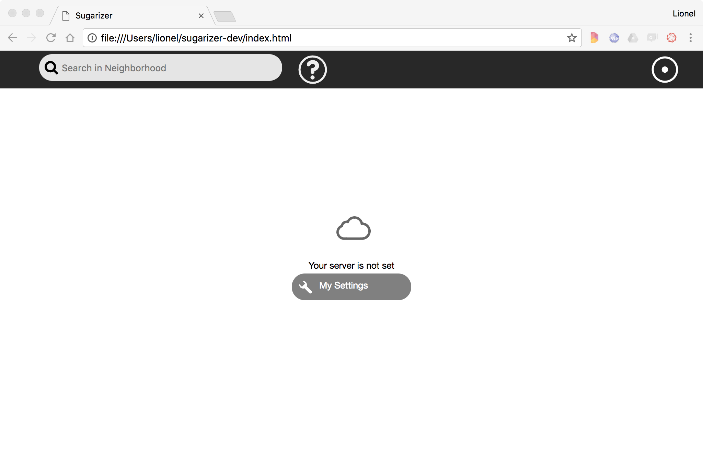

To connect to a server, click on the button to access to settings, then to "About my server" icon to display the server settings window.

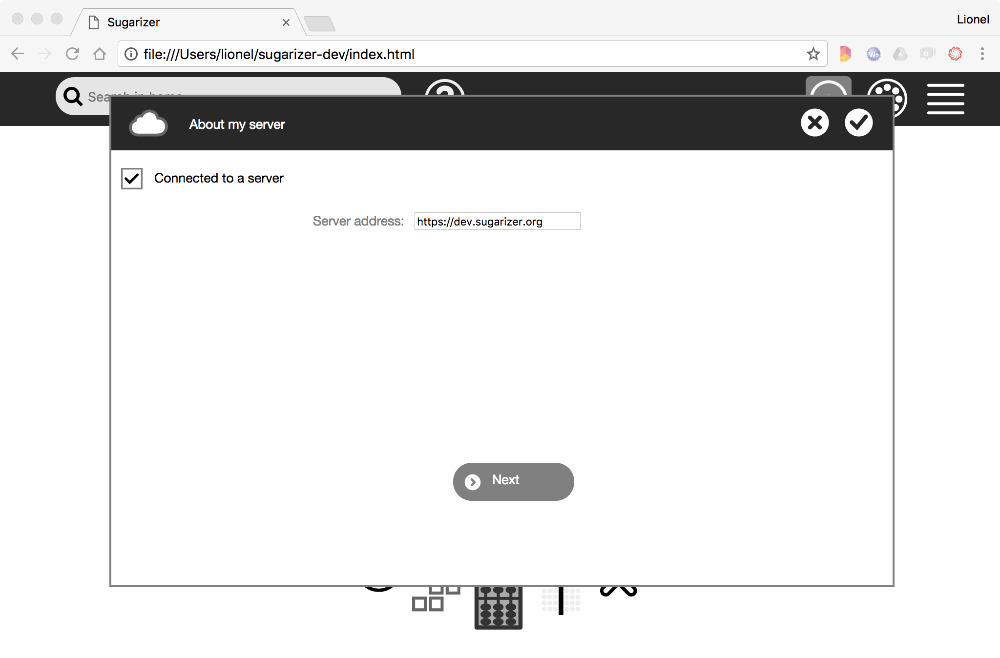

Check the connected box and type the URL of your server, may be `http://localhost:8080` (if you've installed your own server) or `https://dev.sugarizer.org`. You will have to choose few images as password, then click on restart.

If everything is right, you will see now the full Neighborhood view.

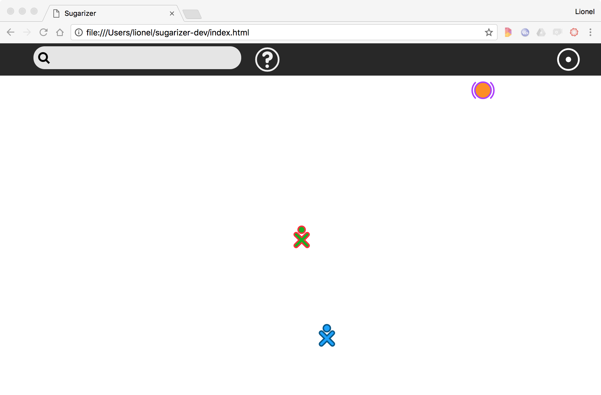

And you're now connected.


## What is meant by sharing an instance

Suppose that Michaël, a user connected on the same server as you want to Chat. He will launch the Chat activity.

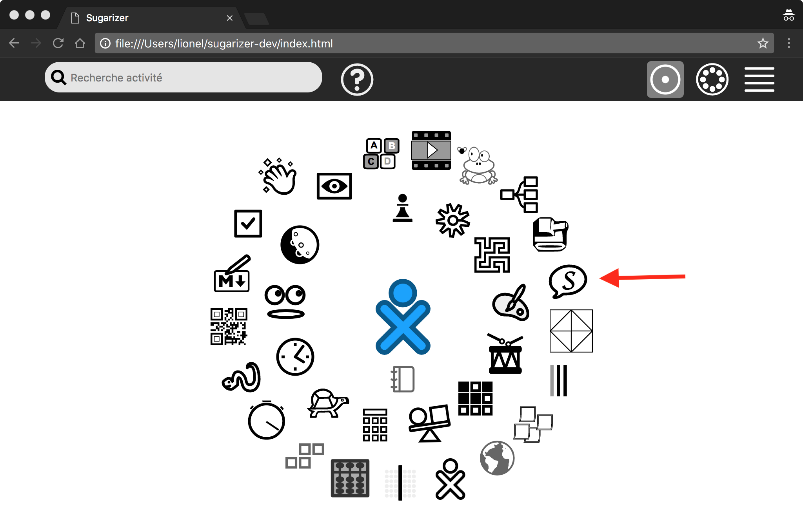

***Tip***: *To connect to Sugarizer with two users on the same computer, open a new "in private" browser window. So you will be able to create a new user. It's what we've done here and what we'll do below to simulate the user Michaël.*

Then, once the activity is open, he can share the activity by clicking on the toolbar Neighborhood button in the Network palette. It's a way for the user to say: *"I want to share my activity on the network"*.  

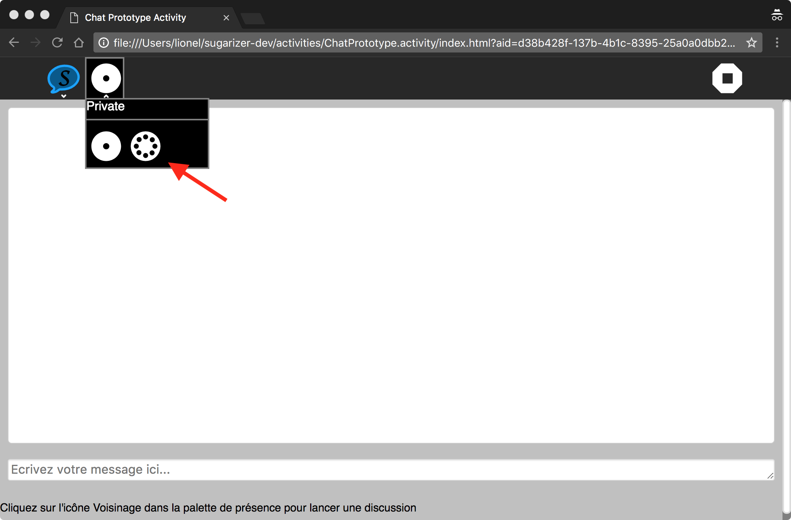

From your Neighborhood view you will see the icon of the activity suddenly appear near the Michaël's icon. Just pass the mouse on the activity icon and click the Join menu and you will be able to join Michaël.

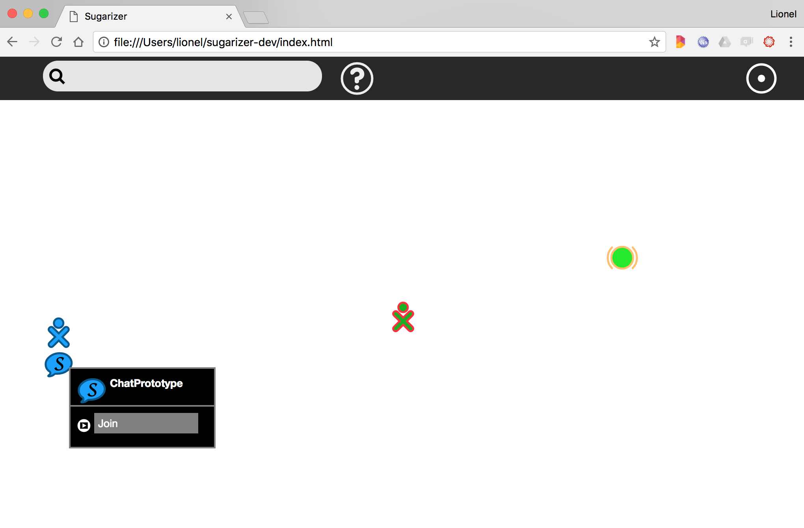.

The Chat activity will open on your side using Michaël colors, and the Chat can start between users.

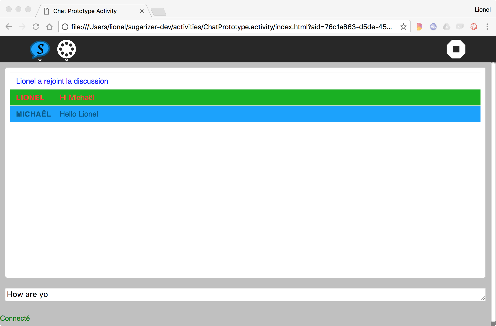

Easy, isn't it ? And thanks to the unique Sugarizer presence framework, do the same thing for our Pawn activity will not be so complex.


## Add the presence palette

All activities that could be shared have to include the Network palette in its toolbar. Like in the Chat activity it's the way for the user to share its current work and allow other users to join. Let's do it in Pawn activity.

First start by adding a button for the network in the `index.html` file. We add it just after the existing `add` button.
```html
<sugar-toolitem id="network-button" title="Network"></sugar-toolitem>
```
We will now define this new button in the `css/activity.css` file. We define also the two buttons included in the palette. Note that all icons are already included in the `lib/sugar-web/graphics/icons/actions` directory.
```css
#main-toolbar #network-button {
	background-image: url(../lib/sugar-web/graphics/icons/actions/zoom-home.svg);
}

#private-button {
	background-image: url(../lib/sugar-web/graphics/icons/actions/zoom-home.svg);
	width: 47px;
	height: 47px;
	margin: 4px 2px;
	color: white;
	color: transparent;
	background-color: transparent;
	background-position: center;
	background-repeat: no-repeat;
	background-size: contain;
	border: 0;
	border-radius: 5.5px;
}

#shared-button {
	background-image: url(../lib/sugar-web/graphics/icons/actions/zoom-neighborhood.svg);
	width: 47px;
	height: 47px;
	margin: 4px 2px;
	color: white;
	color: transparent;
	background-color: transparent;
	background-position: center;
	background-repeat: no-repeat;
	background-size: contain;
	border: 0;
	border-radius: 5.5px;
}
```
The name "palette" refers to a popup menu in the toolbar. When the user clicks on the toolbar icon, the popup appears and display items inside - most often other buttons. To handle this feature Sugar-Web exposes a Palette library and, more precisely, a PresencePalette too. But the good news for Vue.js developers is that the `SugarPresence` component handles the integration of this functionality and let's you use it directly! You are of course encouraged to study the working of the component by looking at `js/components/SugarPresence.js`.

To get the presence palette working, we will add some more attributes to the `network-button`, like this:
```html
<sugar-toolitem 
  id="network-button" 
  title="Network"
  palette-file="sugar-web/graphics/presencepalette" 
  palette-class="PresencePalette"
></sugar-toolitem>
```
The `sugar-toolitem` component is smart, it can create a palette just by specifying the palette-defining file and a palette class.

Let's test the result by launching our Pawn activity.

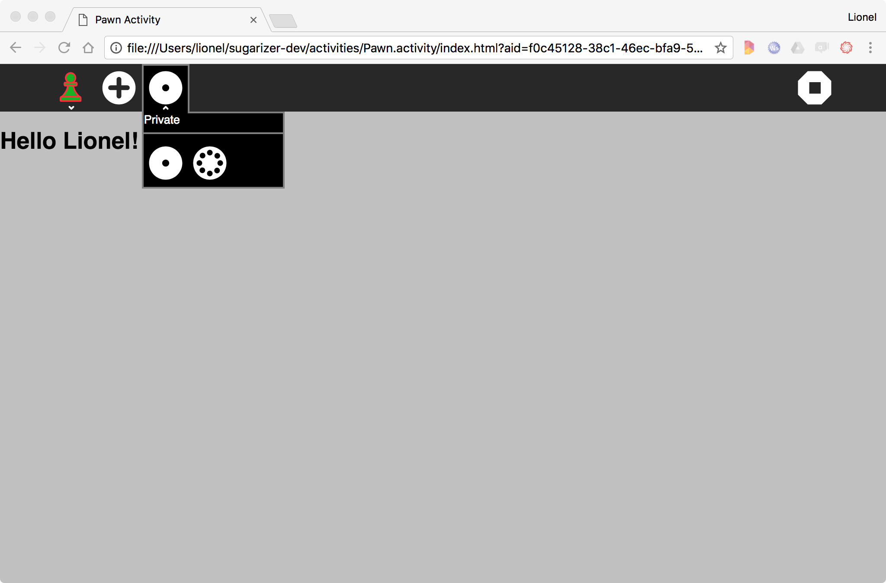

The new Network button and palette is here. We now have to implement the magic inside.


## How presence works

Before further implementation let's pause to explain what exactly Sugarizer presence framework is and what it does.

The presence framework provides a real time communication between a set of clients. To do that the framework is based on the [publish/subscribe](https://en.wikipedia.org/wiki/Publish%E2%80%93subscribe_pattern) pattern. Every client could create one or more **topics**. Other clients could **subscribe** to these topics and everyone could **publish** messages on a topic. When a message is published on a topic, only clients connected to this topic receive the message.

In the context of Sugarizer, clients are Sugarizer App/WebApp connected to the Server. One topic is a shared activity. The Sugarizer Server is responsible to keep the list of topics and clients and dispatch messages to clients subscribed to topics. So the server is the central point and in fact, clients communicate only with the server.

Let's take an example. Michaël, Lionel and Bastien are three users connected to the same Sugarizer Server. Michaël shares a Chat activity. Lionel decides to join the activity. Bastien shares its own Paint activity but he's alone on the activity.

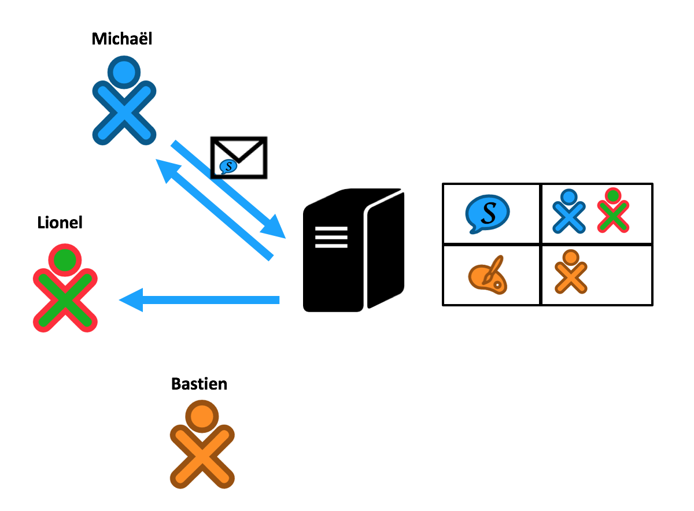

The server knows that two activities are shared: one Chat activity with Michaël and Lionel as subscribers, one Paint activity with only Bastien as subscriber.

If Michaël posts a message for the Chat activity, the server will automatically send back the message to Michaël and Lionel but not to Bastien.

Easy to understand isn't it?


## Share the instance

As usual, let's first include the magic component `SugarPresence`:
```html
<!-- Inside app element -->
<sugar-presence ref="SugarPresence"></sugar-presence>

<!-- After script loads -->
<script src="js/components/SugarPresence.js"></script>
```

Now, let's update our Pawn activity to integrate presence. Start first by handling the click on the Share button. We will add three more attributes to the `network-button`:
```html
<sugar-toolitem 
	id="network-button" 
	title="Network"
	palette-file="sugar-web/graphics/presencepalette" 
	palette-class="PresencePalette"
	palette-event="shared"
	v-on:shared="SugarPresence.onShared"
	v-if="SugarPresence"
></sugar-toolitem>
```
The `presence-event` is the name of the event for which you wish to attach a listener for. This `SugarToolitem` detects this and automatically emits a Vue.js event with the same name, when this event is received from the palette. So, when we click the Share button, the `shared` event is received from the palette to the toolitem, and is then emitted as a Vue event to the instance. This will be handled by the `onShared()` method of the component.

We will also use the `v-if` directive to render this button only `SugarPresence` component exists (This also makes sure `onShared()` is defined at the time of binding).

Now that our activity is shared, we have to slightly update the Add button listener. Because now we should notify other users when a new pawn is played. Here's how the new listener will look like:
```js
onAddClick: function () {
	this.pawns.push(this.currentenv.user.colorvalue);
	this.displayText = this.SugarL10n.get("Played", { name: this.currentenv.user.name });

	if (this.SugarPresence && this.SugarPresence.isConnected()) {
		var message = {
			user: this.SugarPresence.getUserInfo(),
			content: this.currentenv.user.colorvalue
		}
		this.SugarPresence.sendMessage(message);
	}
},
```

If the activity is connected (i.e. `SugarPresence` component exists and `SugarPresence.isConnected()` which tells if presence is initialized), we call the `sendMessage` method. As its name implies, `sendMessage` is the method to send a message to the server. The parameter is the message you want to send. We decided to split the message in two parts: information about `user` that sent the message and the `content`, the user color. The user info is get from SugarPresence component using the `getUserInfo()` call: it will retrieve an object with `name`, `networkId` and `colorvalue`.

That's all we need to create a shared activity and let it appear on the Neighborhood view of other users. We have now to handle what happens when a user clicks on the Join menu. In that case, your activity is automatically open by Sugarizer with a specific parameter in the environment. Another situation where component makes the life easier, it handles the existence of this parameter (`shareId`) and automatically intializes the presence object.

There are 2 important events that you need to handle from the `SugarPresence` instance: `data-received` and `user-changed`. We will create 2 methods to handle these events:
```js
onNetworkDataReceived(msg) {
	// Handles the data-received event
},

onNetworkUserChanged(msg) {
	// Handles the user-changed event
},
```

Now bind these to the event directives:
```html
<sugar-presence ref="SugarPresence" v-on:data-received="onNetworkDataReceived" v-on:user-changed="onNetworkUserChanged"></sugar-presence>
```

The `onNetworkDataReceived` method each time data is receieved from any other connected user on that activity.
```js
onNetworkDataReceived(msg) {
	this.pawns.push(msg.content);
	this.displayText = this.SugarL10n.get("Played", { name: msg.user.name });
},
```
We add the message `content` (i.e. colors for the user sending the message) to our `pawns` array. Then, we update the `displayText` to give the player's name.

Let's try if everything works. From the Michaël browser, launch a new Pawn activity and share it with the network menu.

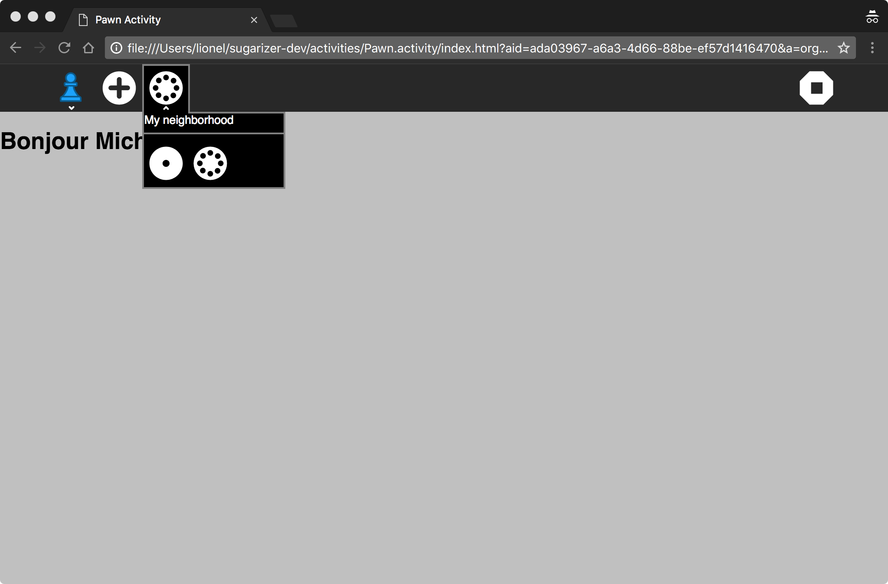

Open the Lionel browser on the neighborhood view. You should see the shared Pawn activity.

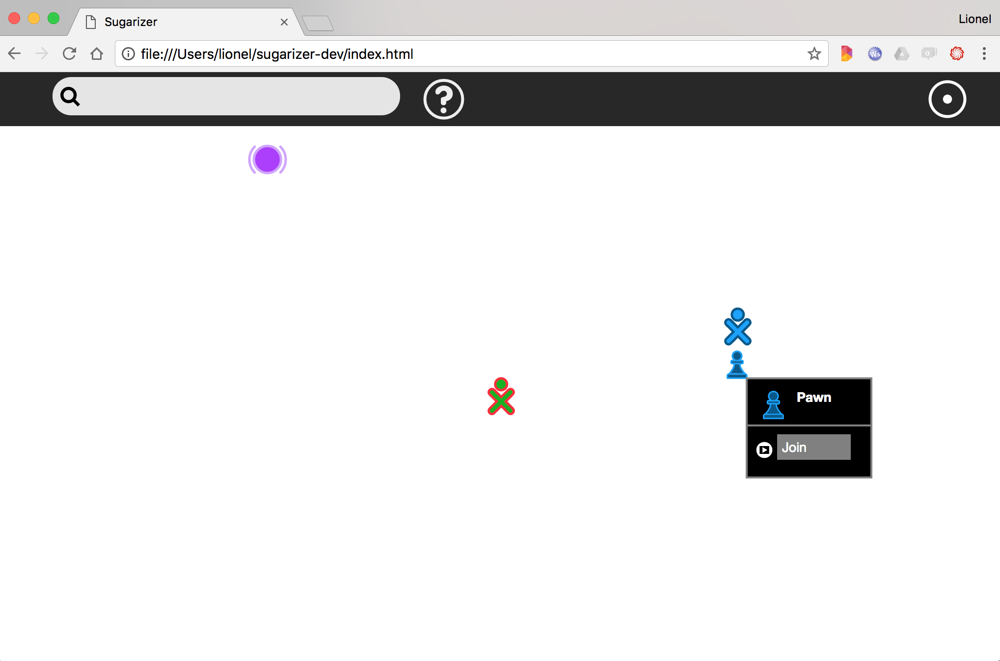

Join the activity by clicking on the Join menu. The activity should open with the Michaël colors.

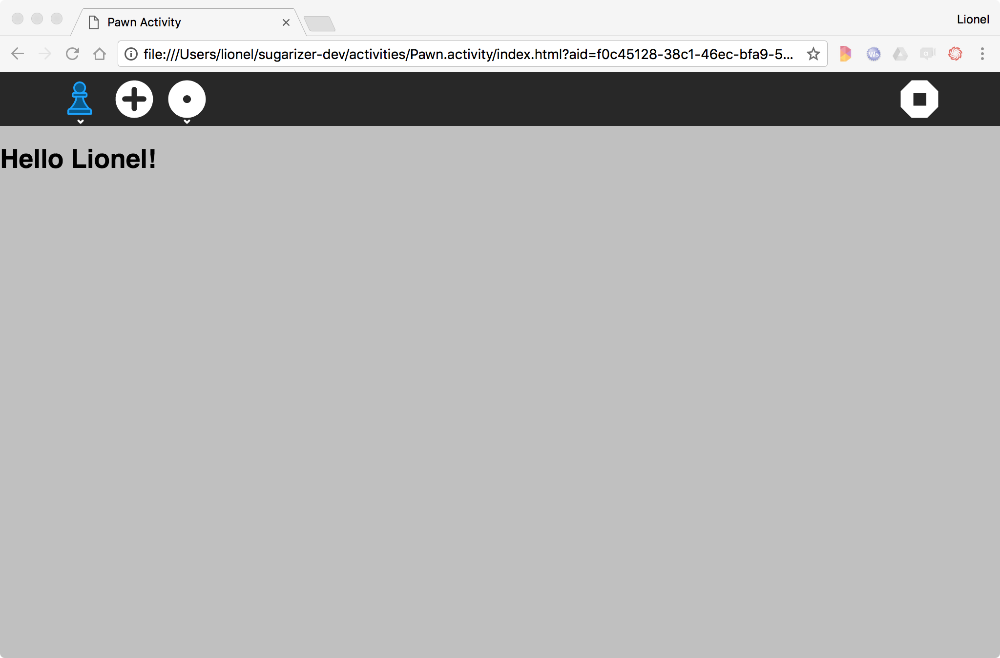

Click on the Plus button on the Lionel or Michaël browser: each time a pawn with the right color should be added to both windows.

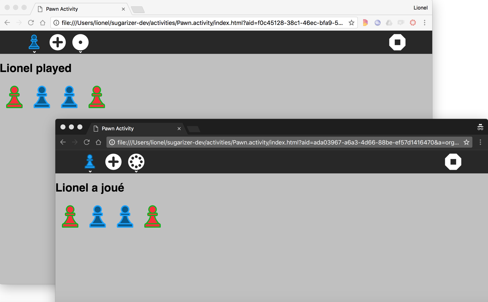

Great isn't it? 

And it works for any number of users connected at the same time on the shared activity!

## Handling subscribers change

Let's go a bit further or more precisely, let's fix a small issue in the previous implementation. 

If Michaël starts to play some pawns on the board before Lionel joins the activity, there will be a difference between the boards:

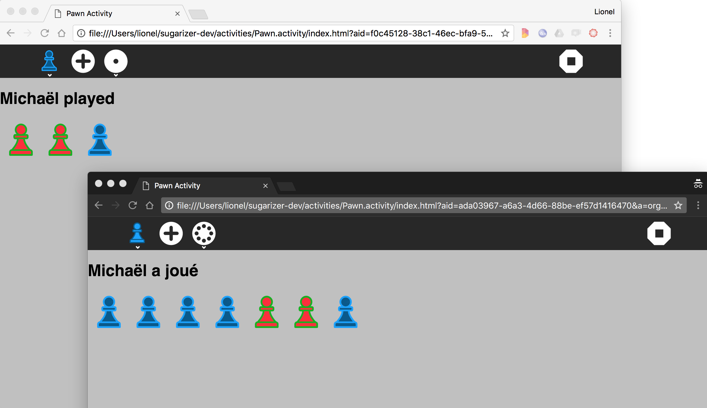

It's like initial plays from Michaël was lost.

This issue is related to the way of handling users that join the activity. Currently nothing is done to give them the initial board state. So they only saw new changes on the board. It could make sense for a chat activity: users who join a chat could not be able to see past discussions. But for our activity, it's not a good thing.

To fix it, let's observe the `onNetworkUserChanged` method:
```js
onNetworkUserChanged: function(msg) {
	console.log(msg);
}
```
The message parameter here is sent automatically by the server when the subscriber's list for a shared activity has changed. You will receive in the message a `move` field telling if the user has joined (the `move` value is `1`) or left (the `move` value is `-1`). And you will receive in the `user` field of the message informations (`name`, `networkId` and `colorvalue`) about the user. 

This message is useful to display a list of users currently connected, and for example displaying this list. Thanks to this message we will be able to fix our current issue.

The idea is to identify the host for the share (Michaël in our sample). When a new subscriber joins the share, the host - and only the host - send to the new subscriber a message with the current board state.
But because the current message contains only the color for the added pawn, we have to create a new type of message for that. Here's the suggested implementation to do that.

First let's modify the current send message call to integrate the 'update' message type to keep compatibility with current implementation:
```js
if (this.SugarPresence && this.SugarPresence.isConnected()) {
	var message = {
		user: this.SugarPresence.getUserInfo(),
		content: {
			action: 'update',
			data: this.currentenv.user.colorvalue
		}
	}
	this.SugarPresence.sendMessage(message);
}
```
Let's tell the host to send the new 'init' message type when the subscriber list change:
```js
onNetworkUserChanged: function(msg) {
	// Handling only by the host
	if (this.SugarPresence.isHost) {
		this.SugarPresence.sendMessage({
			user: this.SugarPresence.getUserInfo(),
			content: {
				action: 'init',
				data: this.pawns
			}
		});
	}
},
```
Here you see a new property being used: `isHost` is a boolean property which stores if the current user is the host of the activity or not. The component handles this for you as well.

Finally, we need to update the `onNetworkDataReceived` method to handle the new message structure:
```js
onNetworkDataReceived: function(msg) {
	switch (msg.content.action) {
		case 'init':
			this.pawns = msg.content.data;
			break;
		case 'update':
			this.pawns.push(msg.content.data);
			this.displayText = this.SugarL10n.get("Played", { name: msg.user.name });
			break;
	}
}
```

Let's repeat the test by launching the activity from Michaël's browser with an initial content (for example from the Journal).

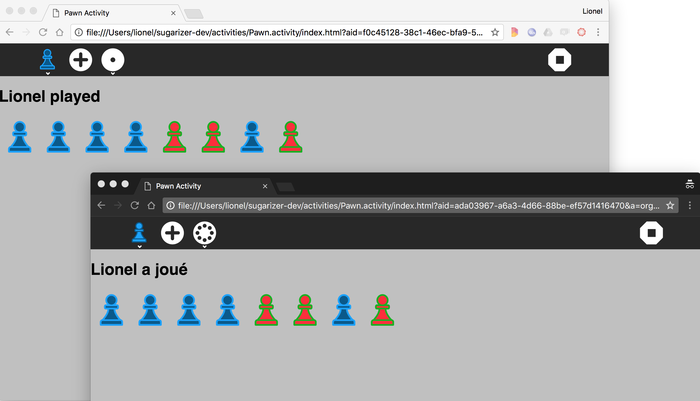

It fully works now!

Implementing a multi-user application is not an easy task but with a nice framework like Sugarizer presence, I'm sure you're convinced now that it's feasible!

[Go to next step](step7.md)