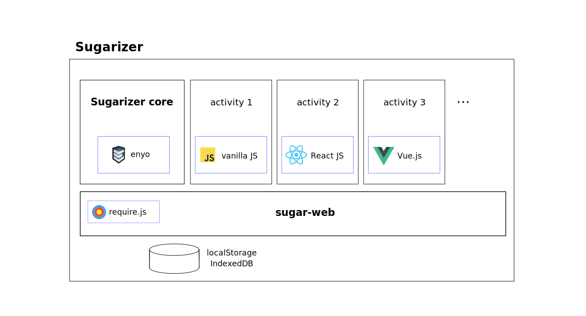
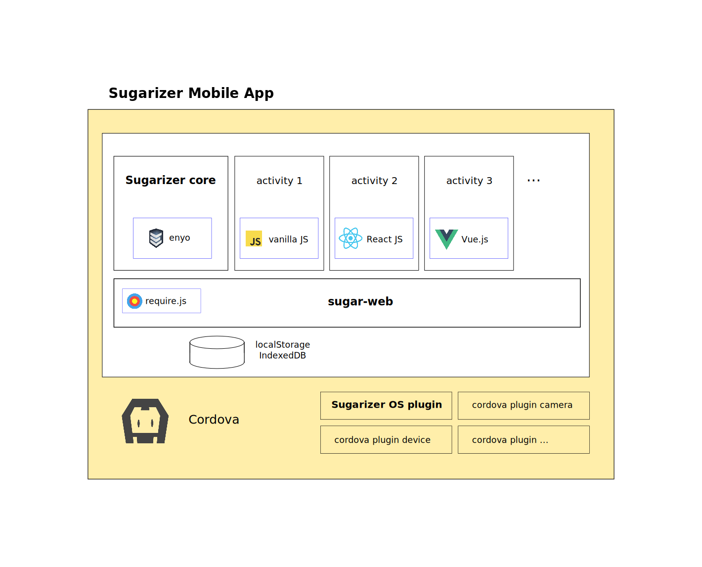
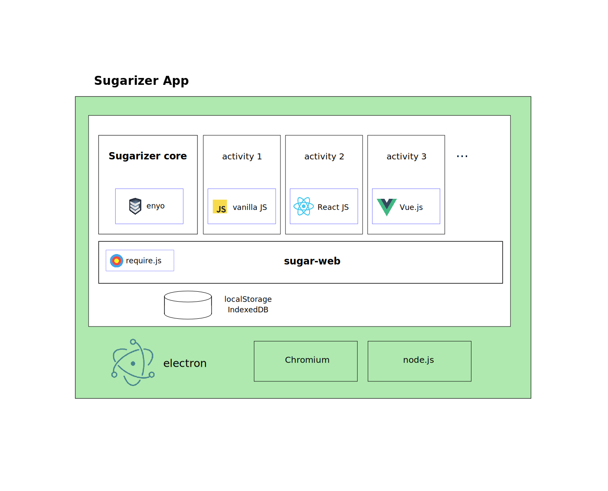

# Architecture

## Global overview
Sugarizer is fully written in HTML5 and JavaScript.

Sugarizer is composed of three components:

* **Sugarizer Core** implements the main Sugarizer UI (home view, list view, Journal view, neighborhood view) and is the launcher for activities.
* **Sugar-Web** contains JavaScript libraries and CSS styles that expose UI and functions to handle Journal, collaboration and controls.
* **Activities** is the set of pedagogic activities included in Sugarizer.

**Sugarizer Core** is independent of activities. Sugarizer Core has it's own `index.html` and redirects the browser to the `index.html` for activities when an activity is launched. The UI of Sugarizer Core use the [Enyo Framework](http://enyojs.com/) and, like activities, rely on Sugar-Web to handle Journal and collaboration.

**Sugar-Web** use localStorage and IndexedDB features of the browser to store Journal content. localStorage is used to store metadata entries, IndexedDB is used to store data entries. localStorage also contains user settings.
Sugar-Web uses Web Sockets for real time communication (presence) with the server and XmlHttpRequest calls on the server REST API to handle remote Journal.
Sugar-Web rely on [require.js](http://www.requirejs.org/) to handle JavaScript libraries dependancies.

**Activities** must use Sugar-Web but could be written using any existing JavaScript framework. Most activities are written without any framework (vanilla JS), some are written using ReactJS, Vue.js, Enyo or other frameworks. When an activity is called by Sugarizer Core, the `QUERY_STRING` contains a calling context. See the dedicated [tutorial](tutorial.md) for more about activity development.

## Portability

The main conception rule of Sugarizer is that all platforms must share the same source code. So Sugarizer runs the same JavaScript/HTML5 code whatever device used: web, mobile or computer.

To do that, the JavaScript/HTML5 code used for the web application is encapsulated into a container to be packaged as an application. See below how it works.

### Mobile App

On mobile platforms (Android, iOS), Sugarizer rely on [Cordova](http://cordova.apache.org/) to package the source code as a native application.

On Android, it's possible to build Sugarizer as a launcher to be able to run native applications directly from the home view. This feature is implemented in a dedicated Cordova plugin named [cordova-plugin-sugarizeros](https://github.com/llaske/cordova-plugin-sugarizeros).

### Desktop App

On desktop platforms (GNU Linux/Mac OS/Windows), Sugarizer relies on  to package the source code as a native application.

