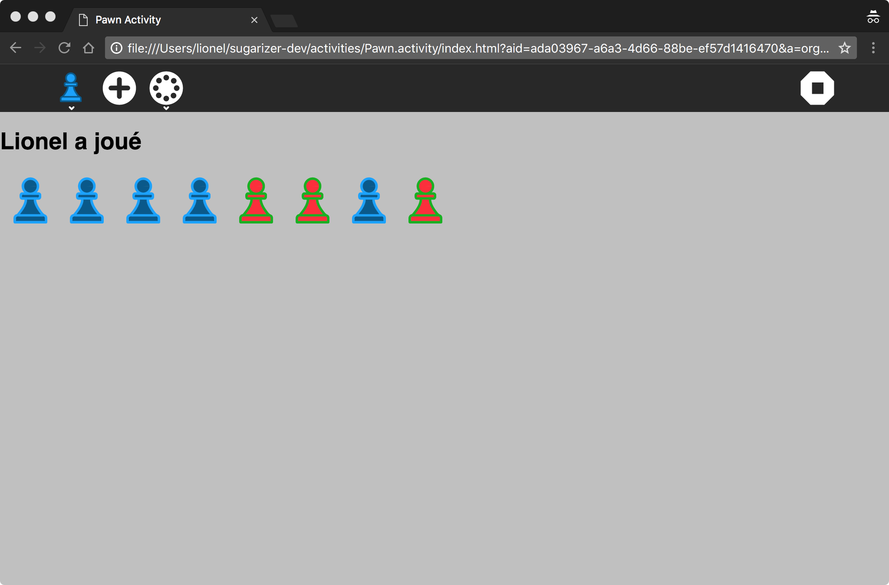

# Create your own activity

With Sugarizer, it's easy to create your own activity with a bunch of HTML and JavaScript. 
In the following tutorial you will learn from scratch how to create a full featured activity named "Pawn".

 

So step after step, you will learn:

* [Step 1](tutorial_step1.md): create the activity from a template
* [Step 2](tutorial_step2.md): customize icon and content
* [Step 3](tutorial_step3.md): add a toolbar icon
* [Step 4](tutorial_step4.md): handle journal and datastore
* [Step 5](tutorial_step5.md): localize the activity
* [Step 6](tutorial_step6.md): handle multi-user with presence

But first let's start with the [Step 0](tutorial_step0.md), set up the development environment.
