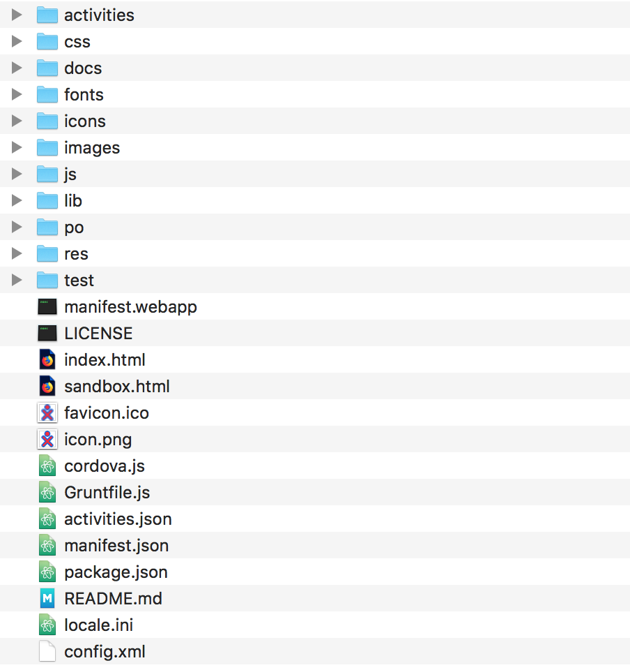
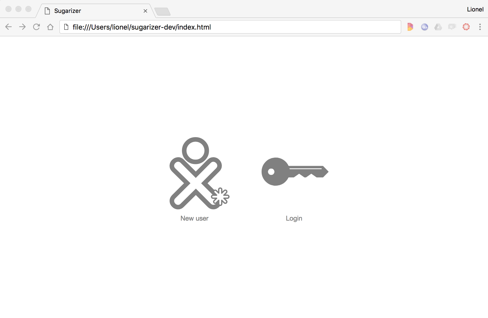
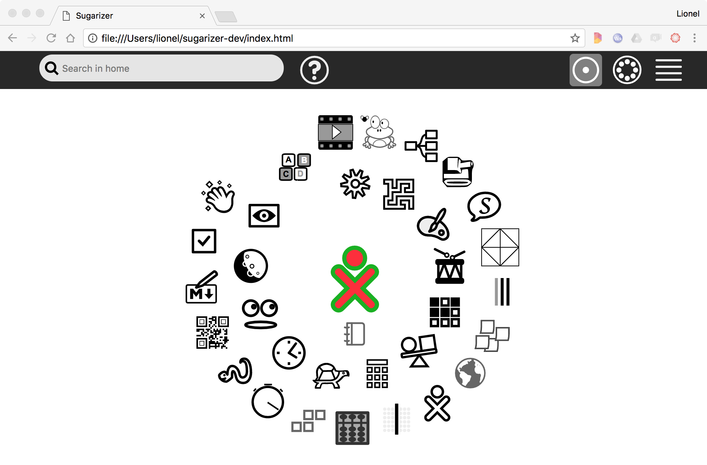
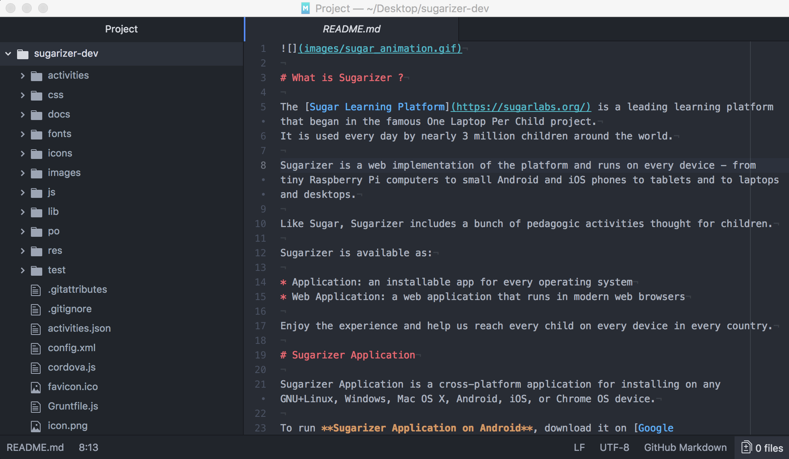

[Go back to tutorial home](tutorial.md)

# Step 0: Set up the development environment
*(Estimated time: 15mn)*

For this tutorial, you will just need a browser and a text editor.
We will run Sugarizer from a local directory that will contain all files needed.


## Create the Sugarizer directory

To start, download **Sugarizer** from [here](https://github.com/llaske/sugarizer/archive/dev.zip). It's a 260MB package so it could take some time. Once downloaded, unzip it.

If you're familiar with **git**, you could clone the repository - dev branch - instead like this:
```shell
git clone -b dev https://github.com/llaske/sugarizer
```
Whatever method used, you should have at end a Sugarizer directory like this:




## Run Sugarizer

We will use **Chrome** in this tutorial but any other browser will work as well.

To run Sugarizer locally in Chrome, close any running instances of Chrome and re-launch it using the command line:

    chrome --allow-file-access-from-files file:\\\Directory:\sugarizer\index.html

Directory in the path above is where you have stored/cloned your sugarizer repo into. Notice the path in the image below to get the gist of it.

* On this line `chrome` is the name of the Chrome executable file. Depending of your system it could be `google-chrome` or `"C:\Program Files (x86)\Google\Chrome\Application\chrome.exe"` or `open -n /Applications/Google\ Chrome.app --args` instead.

* The option `--allow-file-access-from-files` is required to enable access to local files using XMLHttpRequest. Equivalent options for other browser, see how to run *Sugarizer Application into the Web Browser* in [README.md](../../README.md).

* The `index.html` file is located in the new Sugarizer directory so you will have to use `cd` command line to change location to this directory before running the command.

If everything is right, you should see something like that:



Click on "New user", type your name and choose your color, you should see the Sugarizer home view:



To debug your code, it's a good practice too to use the development console of your browser. See [here](https://developers.google.com/web/tools/chrome-devtools/) how to activate this console on Chrome.


## Edit source code

To develop the activity and to update the source code you will need also a **text editor**. You could use for example [Lime](http://limetext.org/) on Linux, [Notepad++](https://notepad-plus-plus.org) on Windows, [Atom](https://atom.io/) on MacOS but any other text editor will work as well.

Let's start by opening the Sugarizer directory in your favorite editor. You should see something like that:



You're now ready to start.

[Go to next step](step1.md)