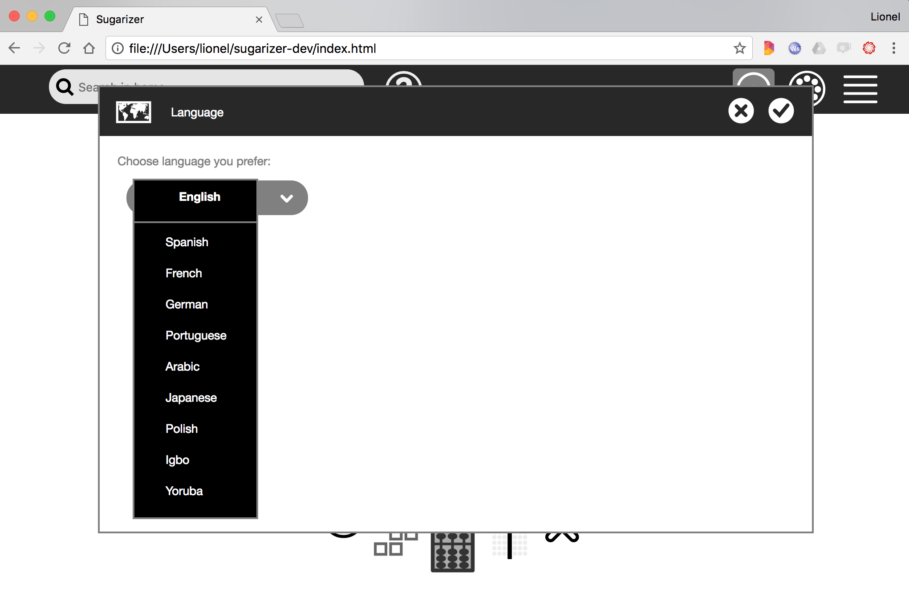
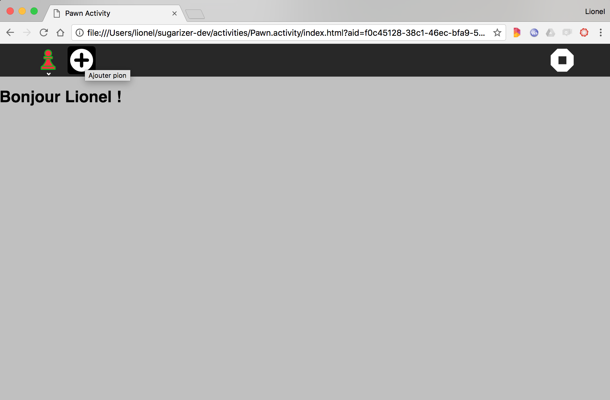

[Go back to tutorial home](tutorial.md)

# Step 5: Localize the activity
*(Estimated time: 15mn)*

Your current Sugarizer session talks probably the same language as you. At the first setup, Sugarizer detects the language of your browser and uses this language for the UI and the activities

You could also change the language from the settings. Hover the mouse on the XO buddy icon on the Sugarizer home view and then click on settings, then to "Language" to display the language settings window.




If you choose another language, this new language will be used for all activities. Let's see how we could use it in our Pawn activity too.


## Identify strings to localize

Sugarizer and Sugar-Web use the [webL10n](https://github.com/fabi1cazenave/webL10n) JavaScript library to handle localization.

The first step when you localize an activity is to identify strings to localize. It means replace hard-coded string in your HTML or JavaScript files by localization resources. In the Pawn activity we've got three strings to localize:

* *"Hello {user}"*: the welcome message
* *"{user} played!"*: when the user played a pawn
* *"Add pawn"*: the helper message on the toolbar button

With the webL10n library, all strings have to be defined in a specific file where all translations for each string should be set. We call this file `locale.ini`.  So using your text editor, let's create a `locale.ini` file at the root of the Pawn activity. Here what it looks likes: 
```ini
[*]
Hello=Hello {{name}}!
Played={{name}} played
AddPawn=Add pawn

[en]
Hello=Hello {{name}}!
Played={{name}} played
AddPawn=Add pawn

[fr]
Hello=Bonjour {{name}} !
Played={{name}} a joué
AddPawn=Ajouter pion

[es]
Hello=Hola {{name}} !
Played={{name}} jugó
AddPawn=Agrega un peón
```

This file is decomposed into sections. One section for each language with the language code between brackets as section name (**en**, **fr**, **es**, ...) and a special section (**\***) for unknown language.

In each section, you have to define translations for each string. The left side of the equal sign is the id of the string (**Hello**, **Played**, **AddPawn**), the right side of the equal sign is the translated string.

For parameterized strings (i.e. strings where a value is inside the string), the double curved bracket **\{\{\}\}** notation is used.

Now we will integrate our new `locale.ini` file into `index.html`:
```html
<!DOCTYPE html>
<html>

<head>
<meta charset="utf-8" />
<title>Pawn Activity</title>
<meta name="viewport" content="user-scalable=no, initial-scale=1, maximum-scale=1, minimum-scale=1, width=device-width, viewport-fit=cover"/>

<!-- Add locale.ini file -->
<link rel="prefetch" type="application/l10n" href="locale.ini">

<link rel="stylesheet" media="not screen and (device-width: 1200px) and (device-height: 900px)"
	href="lib/sugar-web/graphics/css/sugar-96dpi.css">
...
</html>
```

The file is included as a HTML `link` tag and must have a `application/l10n` type to be recognized by webL10n library.


## Initialize localization

We will now see how to initialize localization into the activity source code.

Once again we will first have to integrate a new dependance. So let's add the webL10n library in the first line of `js/activity.js`:
```js
define(["sugar-web/activity/activity", "sugar-web/env", "sugar-web/graphics/icon", "webL10n"], function (activity, env, icon, webL10n) {
```

The webL10n library is able to automatically detect the browser language. But in Sugarizer it's different because the language is decided by the user. So our activity have to initialize current language using the user choice. Once again we're going to use the environment feature to determine the user language. Our current `getEnvironment` call in `js/activity.js` file is like this:
```js
env.getEnvironment(function(err, environment) {
	currentenv = environment;

	// Load from datatore
	if (!environment.objectId) {
		console.log("New instance");
	} else {
		activity.getDatastoreObject().loadAsText(function(error, metadata, data) {
			if (error==null && data!=null) {
				pawns= JSON.parse(data);
				drawPawns();
			}
		});
	}
});
```
Let's update it like this to set the language:
```js
env.getEnvironment(function(err, environment) {
	currentenv = environment;

	// Set current language to Sugarizer
	var defaultLanguage = (typeof chrome != 'undefined' && chrome.app && chrome.app.runtime) ? chrome.i18n.getUILanguage() : navigator.language;
	var language = environment.user ? environment.user.language : defaultLanguage;
	webL10n.language.code = language;

	// Load from datatore
	if (!environment.objectId) {
		console.log("New instance");
	} else {
		activity.getDatastoreObject().loadAsText(function(error, metadata, data) {
			if (error==null && data!=null) {
				pawns = JSON.parse(data);
				drawPawns();
			}
		});
	}
});
```
We're doing three things:

* Determine the `defaultLanguage` for the browser: it's in the `navigator.language` variable except for Chrome OS where you have to get it using a `chrome.i18n.getUILanguage()` call
* Get the user language: it's in `environment.user.language` except if it's not set. In that case, we're using the `defaultLanguage`
* Force the language for webL10n library: you just have to set the value for `webL10n.language.code`.

That's all. The right language is now set into webL10n at startup.


## Set strings value depending on the language

To get the localized version of a string, the webL10n framework provide a simple `get` method. You pass to the method the id of the string (the left side of the plus sign in the INI file) and, if need, the string parameter. So for the welcome message, here is the line to write:
```js
document.getElementById("user").innerHTML = "<h1>"+webL10n.get("Hello", {name:currentenv.user.name})+"</h1>";
```
As you could see the first `get` parameter is the id of the string (**Hello**) and the second parameter is a JavaScript object where each property is the name of the parameter (the one provided inside double curved brackets **\{\{\}\}**, **name** here). The result of the function is the string localized in the current language set in webL10n.

In a same way, the pawn played message could be rewrite as: 
```js
document.getElementById("user").innerHTML = "<h1>"+webL10n.get("Played", {name:currentenv.user.name})+"</h1>";
```
One point however: we need to wait to initialize strings that the `locale.ini` is read. It's possible because the webL10n framework raises a new `localized` event on the window when the language is ready.

So we will now initialize the welcome message in the `localized` event listener like that, in the end of the require function of `js/activity.js` file:
```js
// Process localize event
window.addEventListener("localized", function() {
	document.getElementById("user").innerHTML = "<h1>"+webL10n.get("Hello", {name:currentenv.user.name})+"</h1>";
	document.getElementById("add-button").title = webL10n.get("AddPawn");
});
```
Everything is now ready to handle localization.

Let's test it. Change the Sugarizer language to French and let's see the result.




The welcome message and the button placeholder is now in French. The played message works too.

[Go to next step](step6.md)