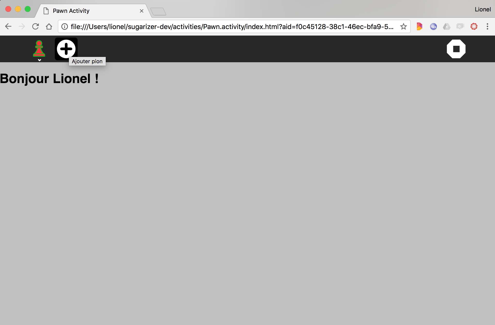

[Go back to tutorial home](tutorial.md)

# Step 5: Localize the activity
*(Estimated time: 15mn)*

Your current Sugarizer session talks probably the same language as you. At the first setup, Sugarizer detects the language of your browser and uses this language for the UI and the activities

You could also change the language from the settings. Hover the mouse on the XO buddy icon on the Sugarizer home view and then click on settings, then to "Language" to display the language settings window.


If you choose another language, this new language will be used for all activities. Let's see how we could use it in our Pawn activity too.

## Identify strings to localize

Sugarizer uses [i18next](https://www.i18next.com/) JavaScript library to handle localization.

The first step when you localize an activity is to identify strings to localize. It means replace hard-coded string in your HTML or JavaScript files by localization resources. In the Pawn activity we've got three strings to localize:

* *"Hello {user}"*: the welcome message
* *"{user} played!"*: when the user played a pawn
* *"Add pawn"*: the helper message on the toolbar button

To enable localization, store all the language-specific strings in the 'locales' folder using language-specific JSON files (e.g., locales/en.json, locales/fr.json).

This file is already present in the root of your activity, open it. You'll observe some content is already present inside, mainly some strings related to timestamps. These string are important for the functioning on another SugarL10n method, `localizeTimestamp(timestamp)` which converts a UNIX timestamp to a Sugarizer time-elapsed string.


Now, add the following content to each file:

`locales/en.json:`
```json
{
  "Hello": "Hello {{name}}!",
  "Played": "{{name}} played",
  "AddPawn": "Add pawn",
}
```

`locales/fr.json:`
```json
{
  "Hello": "Bonjour {{name}} !",
  "Played": "{{name}} a joué",
  "AddPawn": "Ajouter pion",
}
```

`locales/es.json:`
```json
{
  "Hello": "Hola {{name}} !",
  "Played": "{{name}} jugó",
  "AddPawn": "Agrega un peón",
}
```


In each file, you have to define translations for each string. The left side of the equal sign is the id of the string (**Hello**, **Played**, **AddPawn**), the right side of the equal sign is the translated string.

For parameterized strings (i.e. strings where a value is inside the string), the double curved bracket **\{\{\}\}** notation is used.

## Initialize localization

We will now see how to initialize localization into the activity source code.

Once again we will have first to integrate a new component. So let's add the `SugarL10n` to `index.html` and Register it in app instance:
```html
		...
		<!-- Inside app element -->
		<sugar-localization ref="SugarL10n"></sugar-localization>
	</div>

	...
	<!-- After script loads -->
	<script src="js/components/SugarL10n.js"></script>
	<script src="js/activity.js"></script>
</body>
```
```js
const app = Vue.createApp({
	components: {
		"sugar-localization": SugarLocalization,
		...
	},
```

Use the following code to get the SugarL10n (localization) object 
```js
data: function () {
	return {..., SugarL10n: null}
},
created: function () {
    var vm = this;
    window.addEventListener(
        "localized",
        (e) => {
			// Access the localization object using -> e.detail.l10n
			vm.SugarL10n = e.detail.l10n;
        },
        { once: true },
    );
},
```
This code listens for the "localized" event emitted by the SugarL10n.js component and provides access to the l10n object, which exposes methods such as 'get', 'localize', and 'localizeTimestamp', allowing you to utilize these methods for localization purposes.


The `SugarL10n` component automatically detects the language set by the user using the environment and configures the i18next library accordingly.

## Set strings value depending on the language

To get the localized version of a string with params, use `get` method. You pass to the method the key of the string and, if need, the string parameters.

So for the welcome message, here is the line to write in `js/activity.js`:
```js
this.displayText = this.SugarL10n.get("Hello", { name: this.currentenv.user.name });
```
As you could see the first `get` parameter is the id of the string (**Hello**) and the second parameter is a JavaScript object where each property is the name of the parameter (the one provided inside double curved brackets **\{\{\}\}**, **name** here). The result of the function is the string localized in the current sugarizer language.

In a same way, the pawn played message could be rewrite as: 
```js
this.displayText = this.SugarL10n.get("Played", { name: this.currentenv.user.name });
```

To set localized titles to toolbar items, let's define a JavaScript object `l10n` which will store keys of the strings we want (strings here should be static, i.e. without parameters)
```js
data: function () {
	return {
		//...
		l10n: {
			stringAddPawn: "" 
			// ... (add more keys as needed)
		},
	}
},
```

***NOTE:*** *The string key inside the object should be prefixed by the word "string". For example in this case we want the string for `AddPawn`, so in the object we will write `stringAddPawn: ''`.*

We can localize this object by calling the `localize` method: 
```js
this.SugarL10n.localize(this.l10n);
```

Let's bind this to the title of add-button in `index.html`:
```html
<sugar-toolitem id="add-button" :title="l10n.stringAddPawn" @click="onAddClick"></sugar-toolitem>
```


Remember, we wait for the strings in `locales/<lang>.json` to initialize. Our `SugarL10n` component signals a `localized` event on the window when these strings are ready.

```js
// Handles localized event
created: function () {
    var vm = this;
    window.addEventListener(
        "localized",
        (e) => {
			// We Cannot use "vm.currentenv.user.name" here as activity might not be initialized.
			// For that you might want to store the SugarL10n in to the data(state of vue) and use computed values for it
			vm.SugarL10n = e.detail.l10n;
			vm.SugarL10n.localize(vm.l10n);
        },
        { once: true },
    );
},

computed: {
	// Recomputes 'helloString' when SugarL10n or currentenv changes.
	helloString: function() {
		if (!this.SugarL10n || !this.currentenv) return "";
		return this.SugarL10n.get("Hello", { name: this.currentenv.user.name });;
	},
},

```

So now i can use `helloString` inside `index.html` if there's no `displayText`
```html
<h1>{{ displayText || helloString }}</h1>
```

It's worth noting that in simpler cases, direct use of `SugarL10n.localize()` with the `l10n` object may be adequate.

Okay, everything is now ready to handle localization.

Let's test it. Change the Sugarizer language to French and let's see the result.




The welcome message and the button placeholder is now in French. The played message works too.

[Go to next step](step6.md)
