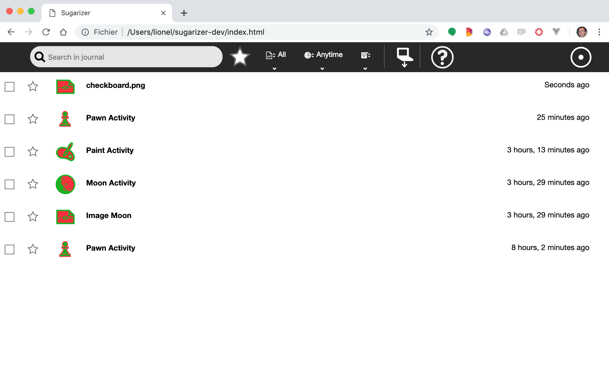

[Go back to tutorial home](tutorial.md)

# Step 7: Use journal chooser dialog
*(Estimated time: 15mn)*

During Step 4 of this tutorial, we've seen how it's possible to store some content into the Journal and reload it into the activity.

In this step, we're going to see another way to integrate content from the Journal into your activity using the Journal chooser dialog.

## From an activity to another

Let's run the Moon activity from the Sugarizer home view.

This activity is a Moon phase viewer. It shows you Lunar phase information and a nice picture of the current Moon phase.
Let's suppose you want to reuse this picture in a drawing. To do that, we're going to save the current view into the Journal as an image.
Just click on the **Export to image** button.


Then stop the activity and go to the Journal view.
You can see a new item named "Image Moon" for the exported image.


Now launch the Paint activity and click on the **Insert Image** button in the toolbar.
The Journal chooser popup will appear.


Click on the Image Moon item in the list, it will be added to your drawing and you will be able to paint on it!


It's a way to use the result of an activity, here Moon, into another activity, here Paint.A Lot of other activities (Record, Labyrinth, Abecedarium, ...) are able to generate contents that other activities (Fototoon, Memorize, Paint, ...) can use. It's why it's useful to understand how the Journal chooser can be integrated into an activity.


## A button to customize the background

Let's suppose that we would like to let the user customize the background of our Pawn activity. So instead of an ugly gray background we could let the user replace it, for example, by a checkboard image.

To do that, let's first add a new button **Insert Image** button in the toolbar like the one in the Paint activity.


First, let's retrieve the icon. 
You could download it [here](../../images/insert-picture.svg). Right-click on it and then save it as a SVG file in `icons/insert-picture.svg`.

Then, let's add our new button. You already know how to do it because you've done it during Step 3. You have to update the toolbar section of the `index.html` file for your activity. Add a `button` tag with the Sugar-Web `toolbutton` class. Here is the result:
```html
<sugar-toolbar ref="SugarToolbar">
  ...

  <sugar-toolitem id="insert-button" title="Change Background"></sugar-toolitem>
  
  ...
</sugar-toolbar>
```

We will now associate the icon to this new button. This association should be done in the `css/activity.css` file. Add these lines at the end of the file.
```css
#main-toolbar #insert-button {
	background-image: url(../icons/insert-picture.svg);
}
```
Let's run the activity. Good job! the new button is here:


## Display the Journal chooser popup

It's time now to add source code to display Journal chooser and integrate our background.

The `journalchooser` has been baked into the `SugarJournal` component too! Hurray! Let's see how to utilize it.

First add a click listener to the picture-button.
```html
<sugar-toolitem id="insert-button" v-on:click="insertBackground" title="Change Background"></sugar-toolitem>
```
And define the following method in `js/activity.js`:
```js
insertBackground: function () {
  var filters = [
    { mimetype: 'image/png' }, 
    { mimetype: 'image/jpeg' }
  ];
  this.$refs.SugarJournal.insertFromJournal(filters, function (data, metadata) {
    // Do nothing at the moment
  })
},
```
This source code calls the `insertFromJournal` method of the `SugarJournal` component. This method take two parameters:

* the first one is an array of filters to identify what type of Journal entries you're looking for. Here we're looking for images, so we set `mimetype` equal to `image/png` or `image/jpeg`. But it's possible too to ask for items from a specific activity by using something like `{ activity: 'org.sugarlabs.Pawn'}`.
* the second one is the callback called when the user clicks on some media element. For the moment, we're leave it empty.

Let's run again the activity. Now, when you click on the new toolbar button the Journal chooser is displayed and the list contains our Moon image.


By the way nothing happens when the item is clicked.


## A nice background

We're going to start by importing a nice checkboard image. You could download it [here](../../images/checkboard.png). Right-click on it and then save it on your desktop. It looks like that:


By combining it multiple times it will become a very nice checkboard.

Let's import first this image into the Journal. To do that, go to the Journal view and click on the **Copy from device** button. Select the `checkboard.png` file then click Open button. 


The file is now into the Journal.



We are now ready to add the source code to change the background. Here's the new way to define the `insertFromJournal` callback:
```js
insertBackground: function () {
  var filters = [
    { mimetype: 'image/png' }, 
    { mimetype: 'image/jpeg' }
  ];
  this.$refs.SugarJournal.insertFromJournal(filters, function (data, metadata) {
    document.getElementById("app").style.backgroundImage = `url(${data})`;
  })
},
```
The callback method receives the content of the item into the `data` parameter. In the case of an image, it's a base64 encoding of the image. Something like: 
```js
data:image/png;base64,iVBORw0KGgoAAAANSUhEUgAAAMgAAADICAIAAAAiOjnJAAAACXBIWXMAAAsTAAALEwEAmpwYAAAAB3RJTUUH4wIRCSUFWSm...
```
This format is natively supported in HTML, so we just need to set this value into the `background-image` style of the canvas element and voilà!

I'm sure you can't wait to test it. Relaunch the Pawn activity, click on the button to show the dialog then click on the checkboard.png image. Here what happens:


Waooow, a very beautiful background for our pawns!

You've learned in this step how to integrate content from the Journal using the Journal chooser dialog. It's a nice way to allow learners to combine multiple activities and create powerful contents.

Note that the background chosen should be stored in the datastore object for the activity else it will be lost on the next launch. It should be interesting also to send it to other connected users. You could try to solve these issues as an exercise.

[Go to next step](step8.md)