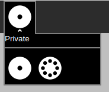
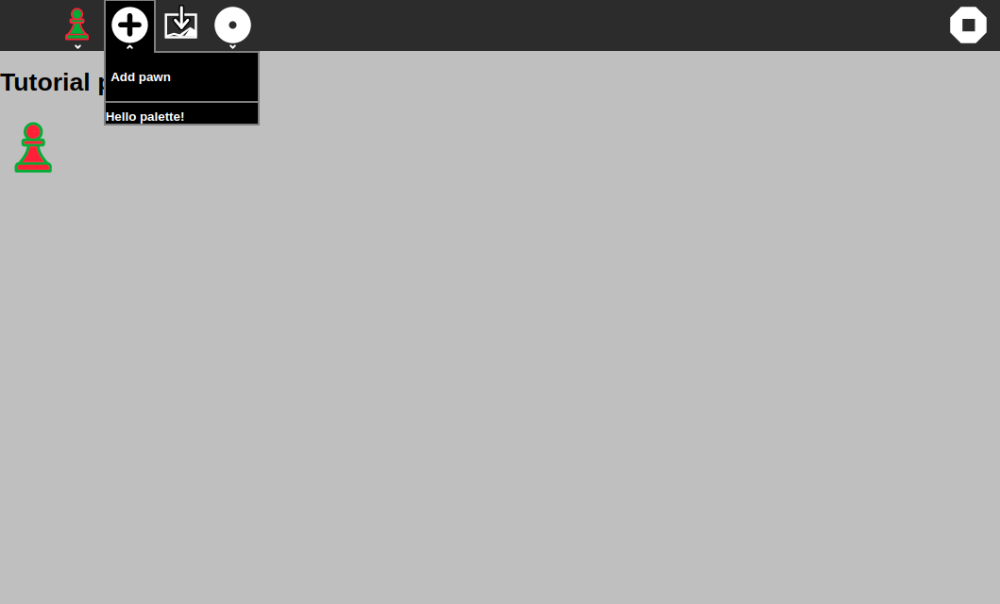
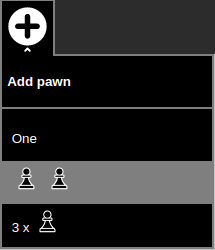
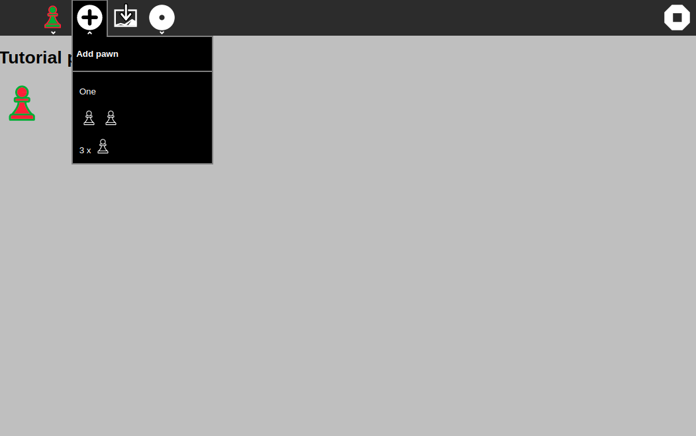
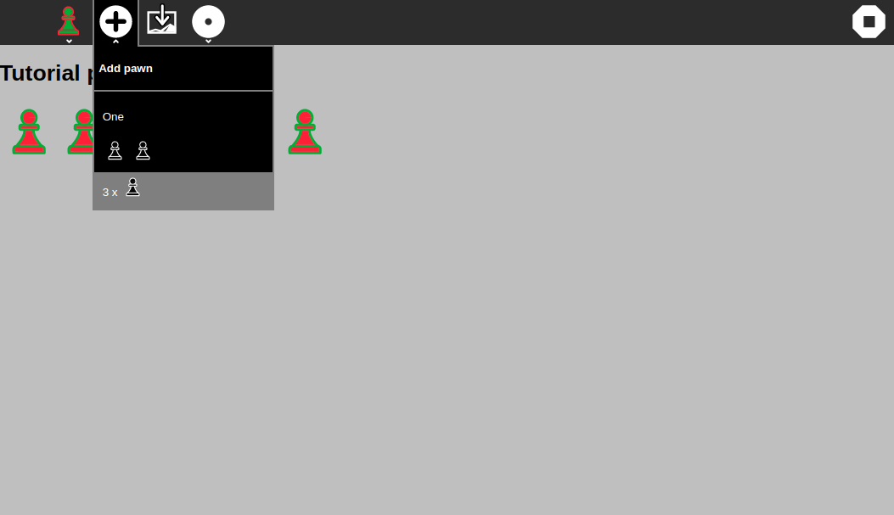

[Go back to tutorial home](tutorial.md)

# Step 8: Create your own palette
*(Estimated time: 15mn)*

Step after step we've added icons in the Pawn activity toolbar. In this new step we're going to improve our toolbar by exploring the creation of "Palette".

In Step 6 of this tutorial, we've added a specific icon in the toolbar for the "Presence Palette". In the Sugar UI, the name "palette" refers to a popup menu in the toolbar. When the user clicks on the toolbar icon, the popup appears and shows items inside.



As we've seen briefly in Step 6, to handle this feature Sugar-Web exposes a Palette library. Let's see how we could use this library and SugarToolitem to create our own palette.


## Create the palette file

To create a new palette, you should first create a new palette file. This file will contain the source code to handle palette behavior.

So, create a new file named `pawnpalette.js` in the `js/palettes/` directory.

***Warning***: *The file should not be created in the `Pawn.activity/src` because palettes are considered to be new libraries.*

Here's the source code to insert into the new Pawn palette file:
```js
define(["sugar-web/graphics/palette"], function(palette) {

	var pawnpalette = {};

	pawnpalette.PawnPalette = function(invoker, primaryText) {
		palette.Palette.call(this, invoker, primaryText);

		var template = '<strong>Hello palette!</strong>';
		var containerElem = document.createElement('div');
		containerElem.innerHTML = template;
		this.setContent([containerElem]);
	};

	var addEventListener = function(type, listener, useCapture) {
		return this.getPalette().addEventListener(type, listener, useCapture);
	};

	pawnpalette.PawnPalette.prototype = Object.create(palette.Palette.prototype, {
		addEventListener: {
			value: addEventListener,
			enumerable: true,
			configurable: true,
			writable: true
		}
	});

	return pawnpalette;
});
```

As we've already seen in Step 2, the `define` function is a way to define a new module and express its dependencies. Here we're going to define a new module that depends on the JavaScript library `sugar-web/graphics/palette`. This `palette` library is precisely the base class for all Palette objects.

So, our new module creates a new `PawnPalette` object and initialize it by calling the Palette constructor with `palette.Palette.call`.

You don't need to understand in detail how it works but the important part here is that the Palette content should be set by a call of the `palette.setContent` function.

Here, the content is just a HTML div element with a simple string `'<strong>Hello palette!</strong>'` inside. In most complex palettes, the content could come from a HTML file or could be a generated set of items.


## Integrate the palette in the toolbar

Let's now integrate our new palette in the toolbar.

It could be done by adding a new button in the toolbar as we've done in Step 3. But here we're going to redefine the behavior for the current **Add** button instead.

As you have seen earlier, to integrate a palette, we will pass some attributes to the `sugar-toolitem`:
```html
<sugar-toolitem 
  id="add-button" 
  v-bind:title="l10n.stringAddPawn" 
  palette-file="js/palettes/pawnpalette.js"
  palette-class="PawnPalette"
  palette-title="Add Pawn"
></sugar-toolitem>
```
This time you need to pass the path to `pawnpalette` library created before. Pass the string "PawnPalette" to `palette-class` as it is the class we defined in the library. Give the `palette-title` as "Add Pawn".

This source code will create the `PawnPalette` object and call the constructor with two parameters:

 * the first one is the toolbar button to associate the palette. As we said, we're reusing our **Add** button.
 * the second one is the header for the palette (`palette-title`). It's an optional parameter used to display a label at the beginning of the palette to explain the palette objective to the user.

Let's run the Pawn activity. Now, when you click on the add toolbar button the palette is displayed.



Funny isn't it?

As an exercise, look what happens when you do not provide a palette title.


## Customize the palette content

Now that we've seen basic concepts of the palette, it's time to improve the UI for our custom palette.

Specifically, we're going to update our palette to allow users to add between 1 and 3 pawns at the same time.

Here's the final look we would like to obtain:




We would like to have 3 items each one that gives an opportunity to users to add a different number of pawns. To explore palette features each item will have a different UI: a text, an image, a text and an image combined.

To do that, we're going to use a HTML file to describe the palette UI. So let's create a new file named `pawnpalette.html` in the `js/palettes/` directory, at the same place as the `pawnpalette.js`.

Put the content above in this new file:
```html
<div id="item-one" class="palette-item">
	One
</div>
<div id="item-two" class="palette-item item-icon">
	
	
</div>
<div id="item-three" class="palette-item item-icon">
	<span class="palette-text">3 x </span>
</div>
```

It creates three `div` elements, each one represent an item and its specific UI. The HTML tags are linked to some new CSS styles. So add to the existing `css/activity.css` file the following content:
```css
.palette-item {
	width: 200px;
	height: 30px;
	padding-top: 15px;
	padding-left: 10px;
}

.palette-item:hover {
	background-color: #808080;
}

.palette-icon {
	width: 30px;
}

.palette-text {
	vertical-align: super;
}

.item-icon {
	padding-top: 3px;
	height: 40px;
}
```

Then we need to update the palette source code to use this HTML file as template for the palette.

First, let's update the first line that define the module. We're going to add a new dependancy on the `pawnpalette.html` file. Here's the line once updated:
```js
define(["sugar-web/graphics/palette","text!pawnpalette.html"], function(palette, template) {
```

The `text!` prefix before the file name tell to **require.js** framework to process the file as text content instead of JavaScript.

Then, because the `template` variable is now initialized by the `define` function, you could remove the line:
```js
var template = '<strong>Hello palette!</strong>';
```
That's all. We're now ready to display our customized palette.

Let's try by running the Pawn activity again.





Waoow. Very beautiful!


## Handle palette event

From the beginning of this lesson, the event handler for the **Add** button is still the same. So, when you click on the button to open the palette, a new pawn appears. And when you click again to close the palette a new pawn appears again. Of course, it's not the expected behavior. It's why we need to change the event.

The first thing to do is to create a custom event for our palette. This event will be raise by the palette when the user will click one of the three items. Here's the source code to do that:
```js
this.pawnClickEvent = document.createEvent('CustomEvent');
this.pawnClickEvent.initCustomEvent('pawn-click', true, true, { count: 0 });
```
This code should be add in the `pawnpalette.js` file, just after the `setContent` call. It will create a new HTML Custom Event named `pawnClick` with a parameter `count` set to 0 by default.

Then let's set the event handler for our three items. Following is the code to do that. You should add it below the previous one.
```js
var that = this;
document.getElementById("item-one").addEventListener('click', function(event) {
	that.pawnClickEvent.count = 1;
	that.getPalette().dispatchEvent(that.pawnClickEvent);
	});
document.getElementById("item-two").addEventListener('click', function(event) {
	that.pawnClickEvent.count = 2;
	that.getPalette().dispatchEvent(that.pawnClickEvent);
	that.popDown();
});
document.getElementById("item-three").addEventListener('click', function(event) {
	that.pawnClickEvent.count = 3;
	that.getPalette().dispatchEvent(that.pawnClickEvent);
	that.popDown();
});
```
This code adds a click listener for each line referenced in our palette UI. As you could check in the `pawnpalette.html` file, `item-one`, `item-two` and `item-three` are identifiers for each line in the palette.
Each listener starts by setting the `count` parameter of the custom event. Then it calls the `dispatchEvent` on the palette object to raise the event.
Finally, the listener calls the palette `popDown` method that, like you could expect, hide/close the palette. To let you see the difference the first item doesn't call this method.

That's all for the palette part. Let's now update the `js/activity.js` file to catch the new custom event.

Modify the `onAddClick()` method to this new source code:
```js
onAddClick: function (event) {
  for (var i = 0; i < event.count; i++) {
    this.pawns.push(this.currentenv.user.colorvalue);
    this.displayText = this.SugarL10n.get("Played", { name: this.currentenv.user.name });

    if (this.SugarPresence.isConnected()) {
      var message = {
        user: this.SugarPresence.getUserInfo(),
        content: {
          action: 'update',
          data: this.currentenv.user.colorvalue
        }
      }
      this.SugarPresence.sendMessage(message);
    }
  }
},
```
And add the `palette-event` and listener to the tool item in `index.html`:
```html
<sugar-toolitem 
  id="add-button" 
  v-bind:title="l10n.stringAddPawn" 
  palette-file="js/palettes/pawnpalette.js"
  palette-class="PawnPalette"
  palette-title="Add Pawn"
  palette-event="pawn-click"
  v-on:pawn-click="onAddClick"
></sugar-toolitem>
```

Shortly, it replaces the `click` listener on the **Add** button by a custom event `pawn-click` listener on the palette.
The source code for the listener is pretty the same as the old one. The only difference is a loop around the old source code. It repeats that as many times as the value of the count event property.

Let's test it.




Open the palette by clicking on the **Add** icon.

Try to click on the first item, it adds one pawn on the board.

Try to click on the second item, it adds two pawns on the board and close the palette.

Try to click on the third item, it adds three pawns on the board and close the palette too.

That's exactly what we expected!

Voila! now you are able to create your own custom palette and how to add an event into it. Note however that there are multiple ways to handle palettes. You could attach methods to the palette or generate its content using HTML generators like the included **Mustache** framework.

To learn more, I suggest you to explore the source code for other activities that use palettes, for example [Paint](https://github.com/llaske/sugarizer/tree/master/activities/Paint.activity) or [Speak](https://github.com/llaske/sugarizer/tree/master/activities/Speak.activity). You could study for example how the Color palette, used in multiple activities, works.

[Go to next step](step9.md)