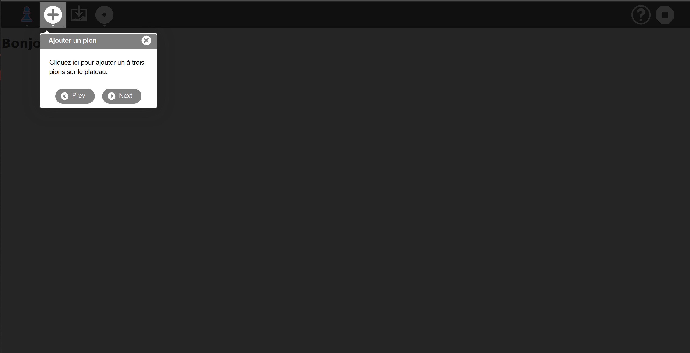

[Go back to tutorial home](tutorial.md)

# Step 9: Integrate a tutorial
*(Estimated time: 15mn)*

Because Sugarizer is a platform dedicated to children, activities should be self-understandable. By the way, it's fair to provide some help to shy users that don't want to click everywhere.

In this tutorial, you'll learn how to easily integrate a tutorial into your Pawn activity.

## What's a tutorial in Sugarizer?

Go to the Sugarizer home view and click on the "?" button to launch the tutorial. Use Next/Prev button to navigate.


As you can see, the tutorial is a set of dialog box that show you the meaning of UI elements by pointing on them.

Let's see how to do the same in our Pawn activity.


## Prepare the UI

First, we're going to prepare the UI of the activity.

Sugarizer users expect to find the help button into the toolbar. It will be our first step to add it.


So, download the help icon `help.svg` [here](../../images/help.svg) and copy it in the `icons` directory of your Pawn activity.

Then, as usual, let's add our new button in the toolbar. To do that we will first update the `index.html` by adding the button at the end of the toolbar:
```html
<sugar-toolbar ref="SugarToolbar">
	...

	<!-- Toolitems with class="pull-right" will be right aligned -->
	<sugar-toolitem id="stop-button" title="Stop" class="pull-right" @click="onStop"></sugar-toolitem>
	<sugar-toolitem id="help-button" title="Tutorial" class="pull-right"></sugar-toolitem>
</sugar-toolbar>
```
Don't forget the `pull-right` class to align it to the right.

We will now associate the icon to this new button. Like in Step 3 of this tutorial, this association should be done in the `css/activity.css` file. Add these lines at the end of the file.
```css
#main-toolbar #help-button {
	background-image: url(../icons/help.svg);
}
```
Let's run the activity to test the result.


The button is here. That's a good start.


## Integrate IntroJs tour components

Sugarizer relies on the [IntroJs library](https://introjs.com/) to produce the UI for the tutorial. 

**Intro.js** is a lightweight JavaScript library for creating step-by-step and powerful customer onboarding tours. Intro.js doesn't have any dependencies. All we need to do is add the JS and CSS file.

Let's see how to integrate it in Pawn activity.

The Vue.js Activity Template already contains the required introJs JavaScript libraries. 

> In case you need to download them again, You could find the `introjs.css` file [here](../../download/introjs.css) and the `intro.js` file [here](../../download/intro.js). Copy these files in your Pawn activity. The first file should be copied in the `css` directory and the other one should be copied in the `lib` directory.

We're now going to reference these files from our `index.html` file. Update the file like that:
```html
...
<link rel="stylesheet" href="css/activity.css">

<link rel="stylesheet" href="css/introjs.css">
<script src="lib/intro.js"></script>
<script src="lib/require.js"></script>
...
```
The main change is to add the link on the CSS file and integrate the libraries into the scripts part. 


## Display the tutorial

Only a few Javascript lines are needed to display a tutorial with introJs tour. And as you might have guessed, we have a component for this too! Not only does it handle the displaying of steps but also has the Sugar UI so you don't have to worry about setting up Bootstrap tour or styling. Awesome!

So, let's create a new Javascript file `lib/tutorial.js` to handle everything related to the tutorial.
```html
	<!-- Inside the app element -->
	<sugar-tutorial ref="SugarTutorial"></sugar-tutorial>

	<!-- After all script loads -->
	<script src="js/components/SugarTutorial.js"></script>
```
```js
// Register the component
const app = Vue.createApp({
	components: {
		"sugar-tutorial": SugarTutorial,
		...
	},
```

## Localize the tutorial

First, let's add text to localize. We need to translate title and content for each dialog box and text for buttons. As we've learned during the Step 5, update your `locales/<lang>.json` files to define new resource strings:

e.g `locales/en.json`
```json
{
	...
	"TutoPrev": "Prev",
	"TutoNext": "Next",
	"TutoExplainTitle": "Pawn Activity",
	"TutoExplainContent": "Welcome into the Pawn activity. This activity is an activity to test Sugarizer development.",
	"TutoAddTitle": "Add pawn",
	"TutoAddContent": "Click here to add one to three pawns on the board.",
	"TutoBackgroundTitle": "Change background",
	"TutoBackgroundContent": "Click here to choose a new background for the board.",
}
```
Also, you should include their translations in JSON files for `fr`, `es`, and `pt`.

Now let's hop over to the `activity.js` and add these strings to the data object:
```js
data: {
	...
	l10n: {
		stringAddPawn: '',
		stringTutoExplainTitle: '',
		stringTutoExplainContent: '',
		stringTutoAddTitle: '',
		stringTutoAddContent: '',
		stringTutoBackgroundTitle: '',
		stringTutoBackgroundContent: '',
	}
},
```
These strings will be localized automatically at the start of the activity from the `localized()` method we created earlier.

Let's also create the click handler method for help-button:
```js
onHelp: function () {
	var steps = [
		{
			title: this.l10n.stringTutoExplainTitle,
			intro: this.l10n.stringTutoExplainContent
		},
		{
			element: "#add-button",
			position: "right",
			title: this.l10n.stringTutoAddTitle,
			intro: this.l10n.stringTutoAddContent
		},
		{
			element: "#insert-button",
			position: "bottom",
			title: this.l10n.stringTutoBackgroundTitle,
			intro: this.l10n.stringTutoBackgroundContent
		}
	];
	this.$refs.SugarTutorial.show(steps);
},
```
We've first defined an array with steps (i.e. dialogs) for the tutorial. Here we've chosen a dialog box to present the activity, then two dialog box to explain the role of "Add" and "Insert Image" buttons. Now as you observe individual steps, we are passing in the localized strings from the `l10n` object.

In the end, we just call `show()` method of the `SugarTutorial` passing in the steps.

Really easy, isn't it?

Can't wait to test it! 

All we need to do now is to call this method on click of the help-button, like this:
```html
<sugar-toolitem id="help-button" title="Tutorial" class="pull-right" @click="onHelp"></sugar-toolitem>

```

That's all. Now launch the activity and click on the help button.


Hurrah! It works!

Also try switching language to French in Sugarizer settings and relaunch the activity:



Congratulation! Your activity has now a tutorial perfectly integrated into Sugarizer environment.

[Go back to tutorial home](tutorial.md)
