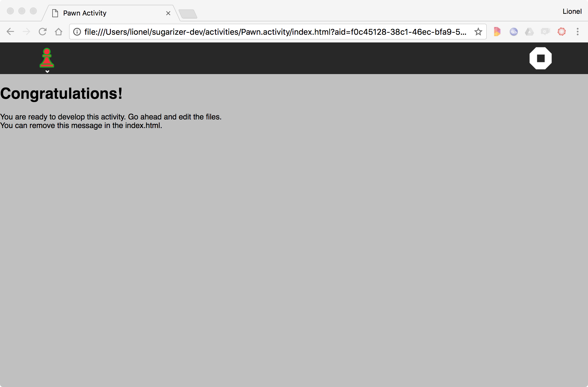
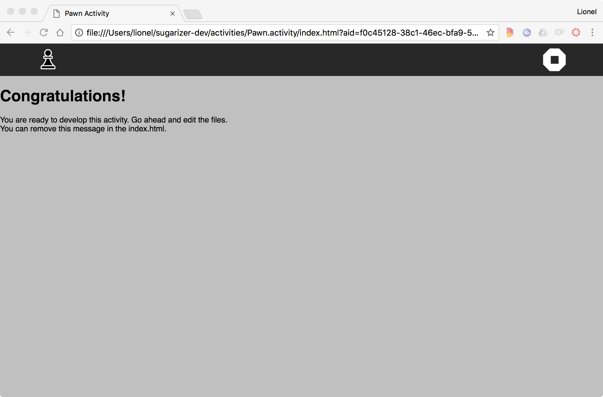
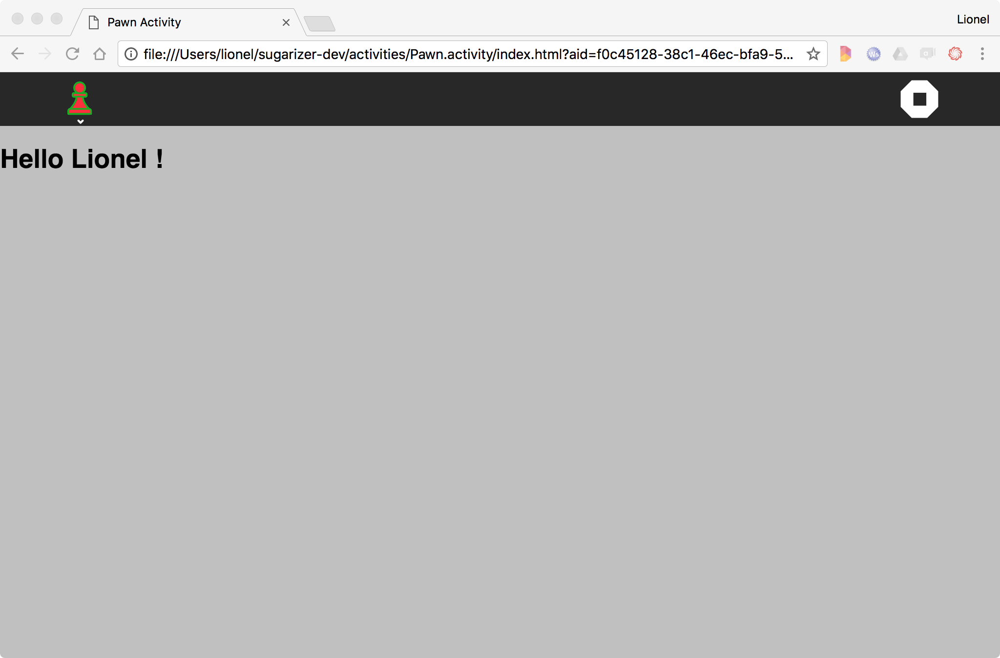

[Go back to tutorial home](tutorial.md)

# Step 2: customize icon and content
*(Estimated time: 30mn)*

Let's now improve our activity to customize the content.

### Customize the icon

The first task is to customize the icon. It's important because it's the visual identity of your activity.

For our new activity, we'll take a Pawn icon inspired by Andrejs Kirma from The Noun Project. You could download this file [here](images/pawn-icon.svg). Right-click on it and then save it in a `pawn-icon.svg` file into a new `Pawn.activity/icons` directory.

In Sugarizer, images for icons or buttons must be SVG graphic files. It needs to be adapted to support users' colors because as you could see on the home page, all icons in Sugarizer are dynamically adapted to users' colors.

To do that, we need to update our original SVG file.
Here's an extract on our original `icons/pawn-icon.svg` file:

	<?xml version="1.0" encoding="UTF-8" standalone="no"?>
	<svg
		xmlns:dc="http://purl.org/dc/elements/1.1/"
    	xmlns:cc="http://creativecommons.org/ns#"
    	xmlns:rdf="http://www.w3.org/1999/02/22-rdf-syntax-ns#"
    	xmlns:svg="http://www.w3.org/2000/svg"
    	xmlns="http://www.w3.org/2000/svg"
    	xmlns:sodipodi="http://sodipodi.sourceforge.net/DTD/ sodipodi-0.dtd"
    	xmlns:inkscape="http://www.inkscape.org/namespaces/inkscape"
    	width="55pt"
    	height="55pt"
    	version="1.1"
    	viewBox="0 0 55 55"
    	id="svg2"
    	inkscape:version="0.91 r13725"
    	sodipodi:docname="pawn-icon.svg">
    	...
		<g
	     id="g4"
	     style="fill:#808080;fill-rule:evenodd" transform="matrix(0.39971901,0,0,0.39971901,6.4164118,6.3421946)">
		    <path
		       style="fill:#808080"
		       d="M 69.117,19.117 C 69.419097,8.5405271 59.563829,-0.82065091 49.016209,0.02487387 38.442487,0.26964532 29.602814,10.583179 30.981695,21.071762 31.767586,31.615772 42.507095,39.916726 52.911417,38.013738 62.017401,36.775538 69.289121,28.312864 69.117,19.117 Z m -32.352,0 C 36.487927,11.039319 44.80784,4.2563204 52.665901,6.151898 60.600506,7.5124622 65.573683,16.956696 62.192903,24.268128 59.309957,31.766263 49.109454,34.806773 42.600068,30.090646 38.995267,27.691276 36.726564,23.451719 36.765,19.117 Z"
		       id="path6"
		       inkscape:connector-curvature="0" />
			...
  		</g>
		<g
		 id="g4230"
		 style="fill:#f0f0f0;stroke:#f0f0f0"
		 transform="matrix(0.39971901,0,0,0.39971901,6.9463181,6.2146783)">
		 ...
		</g>
	</svg>

To adapt this SVG file to Sugarizer, we will update the start of the file to add ENTITY variables named **stroke_color** and **fill_color**.

Then we will replace raw colors value `#xxxxxx` in the SVG file, by reference to `&fill_color;` and `&stroke_color;`.

Here, using your text editor you must replace all `#808080` by `&fill_color;` and all `#f0f0f0` by `&stroke_color;`.

Here is an extract of the result:

	<?xml version="1.0" encoding="UTF-8" standalone="no"?>
	<!DOCTYPE svg  PUBLIC '-//W3C//DTD SVG 1.1//EN'  'http://www.w3.org/Graphics/SVG/1.1/DTD/svg11.dtd' [
		<!ENTITY stroke_color "#010101">
		<!ENTITY fill_color "#FFFFFF">
	]>
	<svg
		xmlns:dc="http://purl.org/dc/elements/1.1/"
    	xmlns:cc="http://creativecommons.org/ns#"
    	xmlns:rdf="http://www.w3.org/1999/02/22-rdf-syntax-ns#"
    	xmlns:svg="http://www.w3.org/2000/svg"
    	xmlns="http://www.w3.org/2000/svg"
    	xmlns:sodipodi="http://sodipodi.sourceforge.net/DTD/ sodipodi-0.dtd"
    	xmlns:inkscape="http://www.inkscape.org/namespaces/inkscape"
    	width="55pt"
    	height="55pt"
    	version="1.1"
    	viewBox="0 0 55 55"
    	id="svg2"
    	inkscape:version="0.91 r13725"
    	sodipodi:docname="pawn-icon.svg">
    	...
		<g
	     id="g4"
	     style="fill:&fill_color;;fill-rule:evenodd" transform="matrix(0.39971901,0,0,0.39971901,6.4164118,6.3421946)">
		    <path
		       style="fill:&fill_color;"
		       d="M 69.117,19.117 C 69.419097,8.5405271 59.563829,-0.82065091 49.016209,0.02487387 38.442487,0.26964532 29.602814,10.583179 30.981695,21.071762 31.767586,31.615772 42.507095,39.916726 52.911417,38.013738 62.017401,36.775538 69.289121,28.312864 69.117,19.117 Z m -32.352,0 C 36.487927,11.039319 44.80784,4.2563204 52.665901,6.151898 60.600506,7.5124622 65.573683,16.956696 62.192903,24.268128 59.309957,31.766263 49.109454,34.806773 42.600068,30.090646 38.995267,27.691276 36.726564,23.451719 36.765,19.117 Z"
		       id="path6"
		       inkscape:connector-curvature="0" />
			...
  		</g>
		<g
		 id="g4230"
		 style="fill:&stroke_color;;stroke:&stroke_color;"
		 transform="matrix(0.39971901,0,0,0.39971901,6.9463181,6.2146783)">
		 ...
		</g>
	</svg>

To update the activity icon, replace also the content of `activity/activity-icon.svg` by the content of the `pawn-icon.svg` file.

Let's run again our activity. Now, we have a beautiful pawn icon.

Note that a Sugar icon set is available in `lib/sugar-web/graphics/icons/`. You could also find more information about how to create icons for Sugar [here](https://wiki.sugarlabs.org/go/Development_Team/Almanac/Making_Icons).

### Customize content

We will now change the content of our Window. More precisely, we're going to replace the **Congratulations** message by a welcome message to the user connected.

Let's first remove the default message, you could find it in `index.html` file:

	<h1>Congratulations!</h1>
	
You are ready to develop this activity. Go ahead and edit the files. 
	You can remove this message in the index.html.

Replace these few lines by a single line:

	

We need only a single `div` because we will generate the welcome message dynamically in JavaScript.

To do that, let's study the file `js/activity.js`. It's really the heart of your new activity. The current implementation is:

	define(["sugar-web/activity/activity"], function (activity) {

		// Manipulate the DOM only when it is ready.
		requirejs(['domReady!'], function (doc) {

			// Initialize the activity.
			activity.setup();

		});

	});

These lines rely on the framework **require.js** that is used by Sugar-Web to handle JavaScript libraries dependancies. You could read more about the **require.js** framework [here](http://www.requirejs.org/) but shortly, there is only two functions to understand: `define` and `require`.

* `define` is a way to define a new module and express its dependencies. Here for example we're going to define a new module that depends on the JavaScript library `sugar-web/activity/activity`. So when the `js/activity.js` is run, **require** will first load the Sugar-Web activity library and put a reference on it in the `activity` variable.

* `requirejs` is pretty the same. It tells to **require**: run the following function but before that, load dependencies and give me a reference to it. There is small hack here because `domReady!` is a special library used to wait for the end of the HTML page loading.

Then comes the most important line of our activity:

	// Initialize the activity.
	activity.setup();

It's a call to the `setup` method of the Sugar-Web activity library.

If you have to keep only one line in your activity, keep that one because it's responsible for all the magic inside Sugarizer: it initializes Datastore, Presence and the Sugarizer UI. A classical error for a beginner in Sugar-Web development is to forget this call. Let's do it by commenting the line:

	// Initialize the activity.
	//activity.setup();

Then run again your new activity. Here's what happens:

Ooops! Colors for our nice icons has disappeared and when you click on the Stop button nothing happens. Clearly you've broken the Sugarizer logic :-(

So uncomment this precious line and never forget to call it again!

		// Initialize the activity.
		activity.setup();

Now, to display our welcome message, we will use the user's name.

To do that we're going to use another Sugar-Web library named **env**. So, we need to add it in our dependencies. Update the define call to add the env Sugar-Web library:

	define(["sugar-web/activity/activity", "sugar-web/env"], function (activity, env) {

This library contains a very interesting method `getEnvironment`. This method allow you to retrieve all users settings: name, prefered colours, language, favorites, ...
So add a call to this method to retrieve the user name:

	// Initialize the activity.
	activity.setup();

	// Welcome user
	env.getEnvironment(function(err, environment) {
			document.getElementById("user").innerHTML = "<h1>"+"Hello"+" "+environment.user.name+" !</h1>";
	});

When you call the getEnvironment method, it should load the Sugarizer environment then call your function with a JavaScript object environment that contains context of your activity and user settings. So we could display our welcome message by forcing HTML in the `div` object using `environment.user.name`. Here's the line:

	document.getElementById("user").innerHTML = "<h1>"+"Hello"+" "+environment.user.name+" !</h1>";

That's all. Run the activity again.

Congratulations! The welcome message will now appear:

[Go to next step](tutorial_step3.md)
