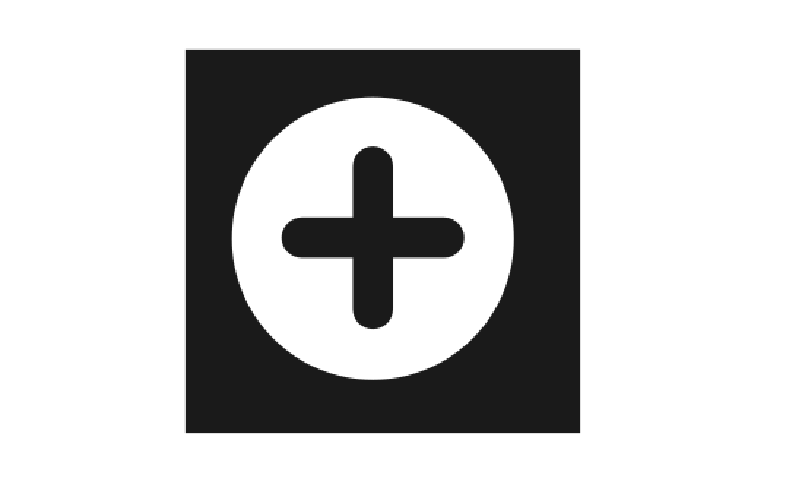
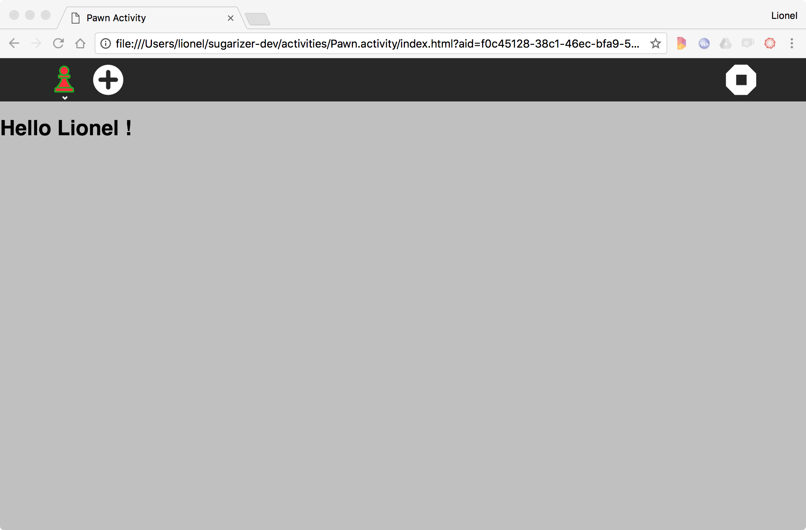
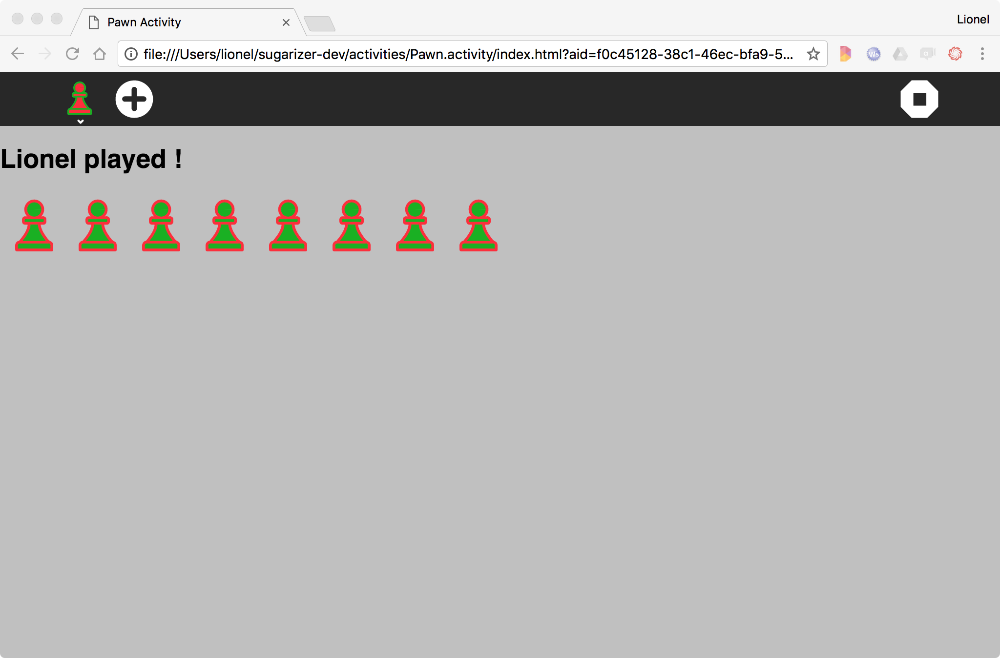

[Go back to tutorial home](tutorial.md)

# Step 3: add a toolbar button

It's time now to implement the logic of our new activity.

Because the activity is called "Pawn", the idea is to allow user to play pawns on the board.

In Sugar, the toolbar - the black area at the top of the window - is the place where activities put actions for the user. So we will add a new button in the toolbar to let the user play a new pawn.

### Create a new toolbar button

Here is the icon we will use. It's just a stylized plus sign.

You could download it [here](https://sugarizer.org/download/add.svg). Save it as a SVG file in `icons/add.svg`.

To add this icon in the toolbar, we will first update the `index.html` file. Look for the toolbar section in the file. It look like this:

	

	  <button class="toolbutton" id="activity-button" title="My Activity"></button>
	
	  <!-- Add more buttons here -->

	
	  <!-- Buttons with class="pull-right" will be right aligned -->
	  <button class="toolbutton pull-right" id="stop-button" title="Stop"></button>
	

Let's add our new button. It's just a `button` tag with the Sugar-Web `toolbutton` class. We give it the value `add-button` for the `id` property. Here is the result:

	

	  <button class="toolbutton" id="activity-button" title="My Activity"></button>
	
	  <!-- Add more buttons here -->
	  <button class="toolbutton" id="add-button" title="Add pawn"></button>
	
	  <!-- Buttons with class="pull-right" will be right aligned -->
	  <button class="toolbutton pull-right" id="stop-button" title="Stop"></button>
	

We will now associate the icon to this new button. This association should be done in the `css/activity.css` file. Add these lines at the end of the file.

	#main-toolbar #add-button {
		background-image: url(../icons/add.svg);
	}

Let's run the activity.

The new toolbar button is now here. Click on it. Of course nothing happen thought there is no logic beside. It's our next step.

### Add the event

To display pawns on the board, we will first update our `index.html` file.

Add a new `div` tag below the one created for the welcome message:

	

	

 
	
We give the value `pawns` for the tag `id` because it will contain all pawns on the board. 

To draw the pawn we will reuse our nice pawn icon. So each time there will be a click on the Plus button, we will add a new pawn icon on the board.

Let's update the `activity/activity.js` to add this. But first, we will slightly adapt our `getEnvironment` call:

		// Welcome user
		var currentenv;
		env.getEnvironment(function(err, environment) {
			currentenv = environment;
			document.getElementById("user").innerHTML = "<h1>"+"Hello"+" "+environment.user.name+" !</h1>";
		});

We just add a `currentenv` variable to store the environment to avoid multiple call.

Then just after the `getEnvironment` call, we will add the following event listener:

		// Handle click on add
		document.getElementById("add-button").addEventListener('click', function (event) {
			var pawn = document.createElement("div");
			pawn.className = "pawn";

			document.getElementById("pawns").appendChild(pawn);

			document.getElementById("user").innerHTML = "<h1>"+currentenv.user.name+" played !</h1>";
		});
 
 This source code do three things:
 
 * Declare a new event listener to add an action on the click event for the HTML element with the `id` value `add-button`, i.e. our toolbar button
 * Create a new `div` element with the `class` value `pawn` and append this element as child of our `pawns` `div`
 * Update the welcome message to indicate that a new pawn has been played by the user

Make sense? Yes, except that something is missing: the link between the `div` created for the pawn and the pawn icon itself. To do that we have to update the `css/activity.css` file. Add these lines at the end of the file:

	.pawn {
	  background-image: url(../icons/pawn-icon.svg);
	  display: inline-block;
	  width: 65px;
	  height: 65px;
	}

It defined a new CSS class named `pawn`, give it few cosmetic properties and specifically our pawn icon as background.

Can't wait to run again our activity:

Waow, it works! Each time we will click on the Plus icon a new pawn will appears.

By the way, we could do better. What if we could change the pawn color?

### Customize again the icon 

Sugar activities very often rely on the user colors. It's a way to let the user think he could customize the color of activities. So, it's a good way to better engage him into the activity.

We decide to update our activity to paint the pawn with the user color. You could think it's complex: it's not! Just a call to another Sugar-Web library named **icon**.

Let's reopen our `activity/activity.js` file.
We will first add the reference to this new library at the begining of the file. Update the first line with:

	define(["sugar-web/activity/activity", "sugar-web/env", "sugar-web/graphics/icon"], function (activity, env, icon) {

We have now three dependancies: **activity**, **env** and **icon**.

The icon library contains a magic method called `colorize`. Just give it a reference to a Sugar-Web icon and a color and it will transform the background to a colorize icon.

Let's add a call to this magic method just after the `appendChild` call:

	document.getElementById("pawns").appendChild(pawn);
	icon.colorize(pawn, currentenv.user.colorvalue);
			
Very simple, we call the method with two parameters: the new pawn element and the user color that we could find in the environment.

That's all. Let's play again with our activity:

Beautiful isn't it?

Note that if you're interested by how to integrate the Sugar UI in your activities, you could find more samples on this subject [here](http://sugarlabs.github.io/sugar-web-samples/).

[Go to next step](tutorial_step4.md)