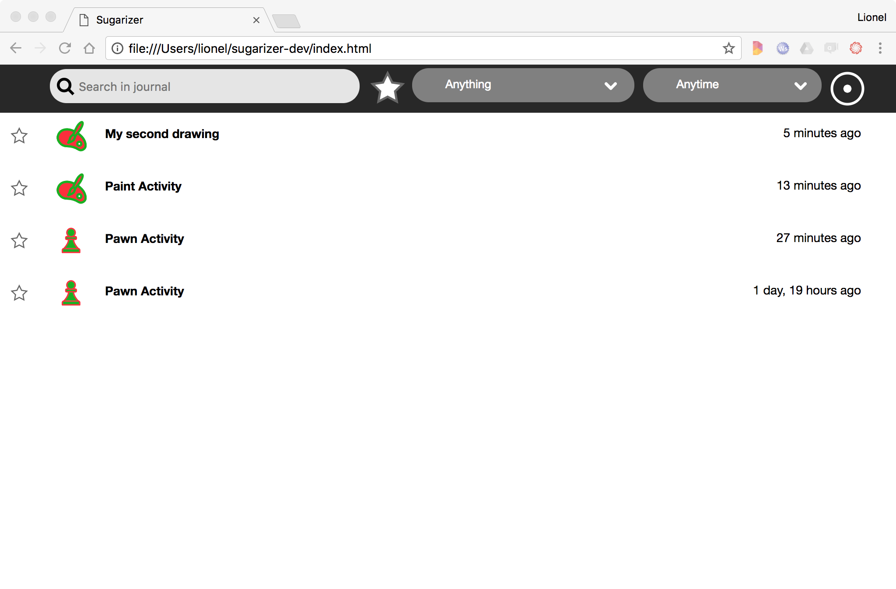

[Go back to tutorial home](tutorial.md)

# Step 4: handle journal and datastore
*(Estimated time: 30mn)*

In the previous step, we've started to see how to use the unique Sugar UI. Let's see now another major feature of Sugar, the Journal, and how to handle it from our activity.

### What is the Journal?

Launch the Paint activity from the Sugarizer home view.

Draw something.

Then stop the activity by clicking on the Stop button to the right.

Relaunch it. You will retrieve the same drawing. That what the Journal is for: take care of your work without need to save it. Stop the activity again and go to the home view. Now just let the mouse on the Paint icon without clicking on it. A popup will appear after one second.

Click on the **Start new** item.

This time a new drawing is created. Draw something else and click on the Paint icon to access the activity menu. Change the text to "*My second drawing*".

Stop the activity to go back to the Sugarizer home view. Then click on the Journal icon under the XO buddy icon.

It will display the Journal view. You will see here all your past work: the initial drawing and the second drawing that you've renamed. Just click on one of these lines to relaunch the activity in the exact state where you leave it. That's why the Journal is so useful.

Note that in the Journal you will see also your new Pawn activity. Let's see how we could handle context saving in this activity like Paint activity.

### Identify the context

The "context" for our Pawn activity is the current number of pawns on the board. So an user could expect to retrieve the same number of pawns when he reopen the activity.

Let's try to implement it.

First we will slightly refactor (i.e. improve) our `activity/activity.js` file. Here is the current implementation:

	// Handle click on add
	document.getElementById("add-button").addEventListener('click', function (event) {
		var pawn = document.createElement("div");
		pawn.className = "pawn";

		document.getElementById("pawns").appendChild(pawn);
		icon.colorize(pawn, currentenv.user.colorvalue);

		document.getElementById("user").innerHTML = "<h1>"+currentenv.user.name+" played !</h1>";
	});

We will refactor it to store pawns in an array `pawns` and to add a new method `drawPawn` to draw all icons at one time. So instead of adding a new `div` element on each button click, we just add a new element in the `pawns` array and we call the `drawPawn` icon to redraw the board. Here is the resulting code:

	// Draw pawns
	var pawns = [];
	var drawPawns = function() {
		document.getElementById("pawns").innerHTML = '';
		for (var i = 0 ; i < pawns.length ; i++) {
			var pawn = document.createElement("div");
			pawn.className = "pawn";

			document.getElementById("pawns").appendChild(pawn);
			icon.colorize(pawn, pawns[i]);
		}
	}

	// Handle click on add
	document.getElementById("add-button").addEventListener('click', function (event) {

		pawns.push(currentenv.user.colorvalue);
		drawPawns();

		document.getElementById("user").innerHTML = "<h1>"+currentenv.user.name+" played !</h1>";
	});

The array `pawns` contain all pawns. It's the context for our activity.

### Store context in the datastore

To store the context, we have to handle the **datastore**. The datastore is the place where Sugar store the Journal. During the activity setup, Sugar-Web automatically initialize the datastore for the activity. The  `activity.getDatastoreObject()` method allow you to retrieve the datastore object allocated for the current activity.
The `setDataAsText` method on this object is a way store a text string inside this object to retrieve it later.
The `save` method store the object when it has been updated.

So below is the source code to store the context in the datastore.

First, convert the **pawns** array as JSON string and store it in the current object.

	var jsonData = JSON.stringify(pawns);
	activity.getDatastoreObject().setDataAsText(jsonData);

Then save the updated object.

	activity.getDatastoreObject().save(function (error) {
		if (error === null) {
			console.log("write done.");
		} else {
			console.log("write failed.");			}
	});

This whole code should be call at the end of the activity. To do that we have to catch the click on the Stop button of the activity. So here is the complete source code we will add in the `activity/activity.js` file, just below the `add-button` event listener:

	// Save in Journal on Stop
	document.getElementById("stop-button").addEventListener('click', function (event) {
		console.log("writing...");
		var jsonData = JSON.stringify(pawns);
		activity.getDatastoreObject().setDataAsText(jsonData);
		activity.getDatastoreObject().save(function (error) {
			if (error === null) {
				console.log("write done.");
			} else {
				console.log("write failed.");
			}
		});
	});

It's the first step: the board is now safely save in the datastore.

Let's know how we could retrieve it.

### Detect the need to load the context

Our Pawn activity works well when it's called from the **Start new** menu, i.e. with a new instance. Because in that case we don't have to reload the context.
So the first question to ask is: how to detect that we need to load the context?

Once again, the Sugar-Web environment could help us. When an activity is launched from an existing context, environment contains an `objectId` property with the identifier for the datastore object. When an activity is launch with a new instance, this property is null.

So we will update our request on environment in `activity/activity.js` to test this variable:

	env.getEnvironment(function(err, environment) {
		currentenv = environment;
		document.getElementById("user").innerHTML = "<h1>"+"Hello"+" "+environment.user.name+" !</h1>";

		// Load from datastore
		if (!environment.objectId) {
			console.log("New instance");
		} else {
			console.log("Existing instance");
		}
	});

Let's display the JavaScript console on your browser and test it. Launch the Pawn activity from the **Start new** menu or from List view of activities. Here is the result:

Now open the Pawn activity from the Journal or by clicking on the Pawn icon on the Home view. Here is the result:

Of course, the context is not loaded for the moment in the activity but at least we've got a way to detect when it should be loaded and when it shouldn’t be loaded.

### Load context from the datastore

When our activity is launched with a new instance - the first branch from the previous `if` instruction, there is nothing to do. In that case, the `pawns` will be initialize with an empty array as today.

When our activity is launched with an existing instance - the `else` branch, we have to load the context to init our `pawns` array.

In the same way that the `setAsText`/`save` methods, the datastore object provide a `loadAsText` method to retrieve the string stored in an object. So the code we will have to write to retrieve our context is:

	activity.getDatastoreObject().loadAsText(function(error, metadata, data) {
		if (error==null && data!=null) {
			pawns = JSON.parse(data);
		}
	});

We load the string - in the data parameter -, we parse it to an object and we set it in our `pawns` array. That's all for the initialization but we need also to draw it, so here is the full source code to write in `activity/activity.js`:

	// Load from datastore
	if (!environment.objectId) {
		console.log("New instance");
	} else {
		activity.getDatastoreObject().loadAsText(function(error, metadata, data) {
			if (error==null && data!=null) {
				pawns = JSON.parse(data);
				drawPawns();
			}
		});
	}

Let's try if it works.

Launch the Pawn activity from the **Start new** menu. Here is the result:

The activity display a blank board as expected.

Click few times on the Plus button to add some pawns and stop the activity. Now re-open the activity by clicking on the Pawn icon on the Home view. Here is the result:

Yes! It's what we expected too: the activity reopens with the right number of pawns.

The Journal is now fully supported by the Pawn activity.

[Go to next step](tutorial_step5.md)
