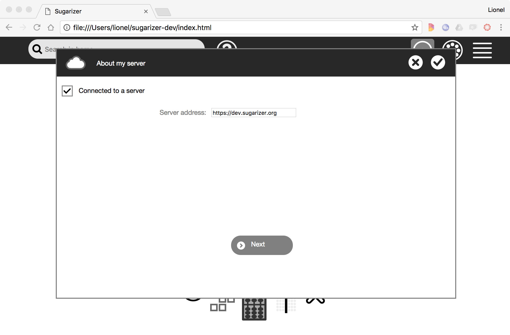
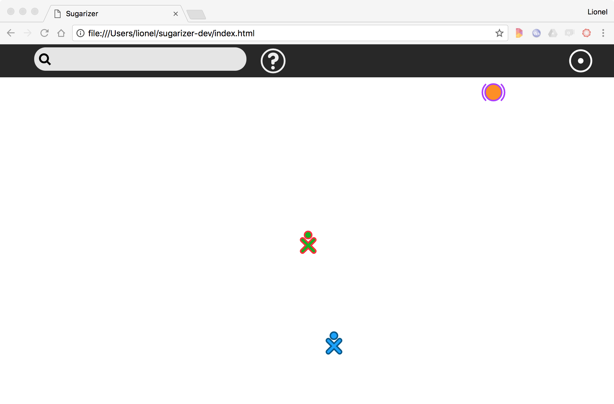
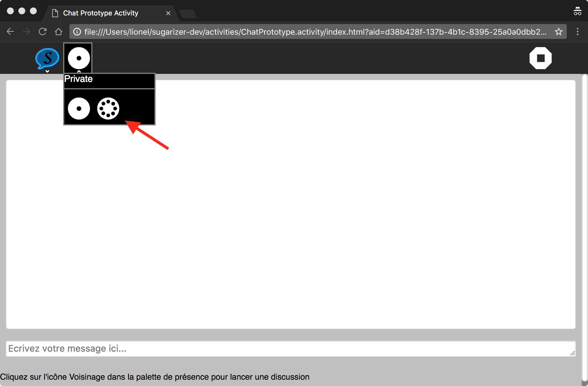
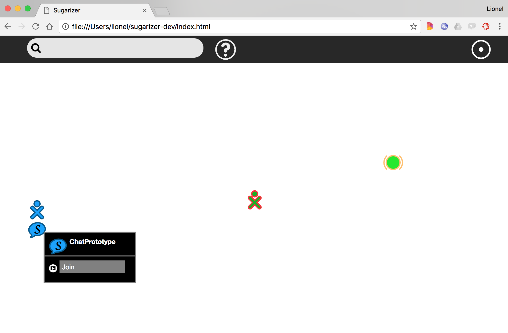
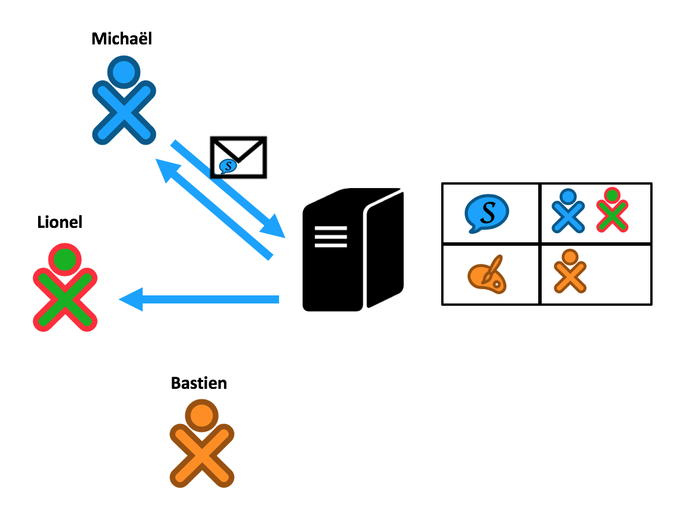
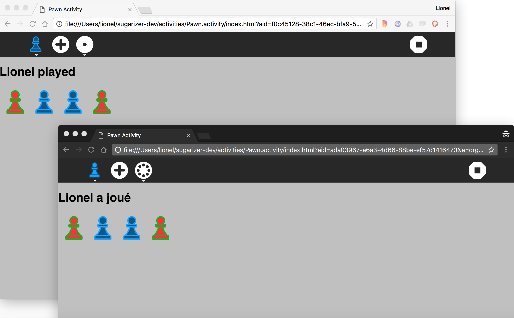

[Go back to tutorial home](tutorial.md)

# Step 6: handle multi-user with presence

What if the Pawn activity could be played by multiple players at the same time? After all, it's a logical feature for a game. That's what we will doing in this step.

### Connect to a server

From the begining of this tutorial we use Sugarizer stand alone. All HTML and JavaScript are run locallly and do not depend of external code. For this step however, because we need to have communication between multiple clients, we will need a Sugarizer Server too. The Sugarizer Server is a backend that provide connection features to Sugarizer Apps.

You could install a Sugarizer Server locally following instruction [here](https://github.com/llaske/sugarizer-server/blob/master/README.md) or use the test server available on [https://dev.sugarizer.org](https://dev.sugarizer.org).

To see if you're connected to a server, click on the Neighborhood view - the icon with multiple dot - on the Sugarizer toolbar. Because you're not connected yet, here is the message you will see:

To connect to a server, click on the button to access to settings, then to "About my server" icon to display the server settings window.

Check the connected box and type the URL of your server, may be `http://localhost:8080` (if you've installed your own server) or `https://dev.sugarizer.org`. You will have to choose few images as password, then click on restart.

If everything is right, you will see now the full Neighborhood view.

And you're now connected.

### What mean sharing an instance

Suppose that Michaël, an user connected on the same server than you want to Chat. He will launch the Chat activity.

***Tip***: *To connect to Sugarizer with two users on the same computer, open a new "in private" browser window. So you will be able to create a new user. It's what we've done here and what we'll do below to simulate the user Michaël.*

Then, once the activity will be open, he will share the activity by clicking on the toolbar Neighborhood button in the Network palette. It's a way for the user to say: *"I want to share my activity on the network"*.  

From your Neighborhood view you will see the icon of the activity suddenly appear near the Michaël's icon. Just pass the mouse on the activity icon and click the Join menu and you will be able to join Michaël.

.

The Chat activity will open on your side using Michaël colors, and the Chat can start between users.

Easy, isn't it ? And thanks to the unique Sugarizer presence framework, do the same thing for our Pawn activity will not be so complex.

### Add the presence palette

All activities that could be shared have to include the Network palette in its toolbar. Like in the Chat activity it's the way for user to share its current work and allow other users to join. Let's do it in Pawn activity.

First start by adding a button for the network in the `index.html` file. We add it just after the existing `add` button.
  
	<button class="toolbutton" id="network-button" title="Network"></button>

We will now define this new button in the `css/activity.css` file. We define also the two buttons included in the palette. Note that all icons are already included in the `lib/sugar-web/graphics/icons/actions` directory.

	#main-toolbar #network-button {
	  background-image: url(../lib/sugar-web/graphics/icons/actions/zoom-home.svg);
	}
	
	#private-button {
	  background-image: url(../lib/sugar-web/graphics/icons/actions/zoom-home.svg);
	  width: 47px;
	  height: 47px;
	  margin: 4px 2px;
	  color: white;
	  color: transparent;
	  background-color: transparent;
	  background-position: center;
	  background-repeat: no-repeat;
	  background-size: contain;
	  border: 0;
	  border-radius: 5.5px;
	}
	
	#shared-button {
	  background-image: url(../lib/sugar-web/graphics/icons/actions/zoom-neighborhood.svg);
	  width: 47px;
	  height: 47px;
	  margin: 4px 2px;
	  color: white;
	  color: transparent;
	  background-color: transparent;
	  background-position: center;
	  background-repeat: no-repeat;
	  background-size: contain;
	  border: 0;
	  border-radius: 5.5px;
	}

The name "palette" refer to a popup menu in the toolbar. When the user click on the toolbar icon, the popup appear and display items inside - most often other buttons. To handle this feature Sugar-Web expose a Palette library and, more precisely, a PresencePalette too. 

As usual, to integrate this library, we will update the dependancies list at the first line of `activity/activity.js`.

	define(["sugar-web/activity/activity", "sugar-web/env", "sugar-web/graphics/icon", "webL10n","sugar-web/graphics/presencepalette"], function (activity, env, icon, webL10n, presencepalette) {

This palette must be initialized in the code. You just have to call the PresencePalette constructor with the toolbar element. So add this line into `activity/activity.js`:

	// Link presence palette
	var palette = new presencepalette.PresencePalette(document.getElementById("network-button"), undefined);
		
Let's test the result by launching our Pawn activity.

The new Network button and palette is here. We now have to implement the magic inside.

### How presence works

Before further implementation let's pause to explain what exactly Sugarizer presence framework is and do.

The presence framework provide a real time communication between a set of clients. To do that the framework is based on the publish/subscribe model. Every client could create one or more **topics**. Other clients could **subscribe** to these topics and everyone could **publish** messages on a topic. When a message is published on a topic, only clients connected to this topic receive the message.

In the context of Sugarizer, clients are Sugarizer App/WebApp connected to the Server. One topic is a shared activity. The Sugarizer Server is responsible to keep the list of topics and clients and dispatch messages to clients subscribed to topics. So the server is the central point and in fact, clients communicate only with the server.

Let's take an example. Michaël, Lionel and Bastien are three users connected to the same Sugarizer Server. Michaël share a Chat activity. Lionel decide to join the activity. Bastien share its own Paint activity but he's alone on the activity.

The server know that two activities are shared: one Chat activity with Michaël and Lionel as subscribers, one Paint activity with only Bastien as subscriber.

If Michaël post a message for the Chat activity, the server will automatically send back the message to Michaël and Lionel but not to Bastien.

Easy to understand isn't it?

### Share the instance

Now, let's update our Pawn activity to integrate presence. Start first by handling the click on the Share button. We will add a listener to handle `shared` event of the palette in the `activity/activity.js` file. 

	// Link presence palette
	var presence = null;
	var palette = new presencepalette.PresencePalette(document.getElementById("network-button"), undefined);
	palette.addEventListener('shared', function() {
		palette.popDown();
		console.log("Want to share");
		presence = activity.getPresenceObject(function(error, network) {
			if (error) {
				console.log("Sharing error");
				return;
			}
			network.createSharedActivity('org.sugarlabs.Pawn', function(groupId) {
				console.log("Activity shared");
			});
			network.onDataReceived(onNetworkDataReceived);
		});
	});

In this listener, we have to retrieve the presence object. As usual it's exposed by the `activity` object. So you just need a call to `activity.getPresenceObject` method. If everything goes well, you will retrieve a presence object. That's a way to indicate that you're connected to a server.

The `createSharedActivity` on this object allow you to create a new shared activity. You must pass as parameter the type of the activity so Sugarizer could display the right icon in the neighborhood view. Then you receive the unique identifier of the share in the `groupId` parameter of the callback.

Finally we register a callback to handle message received, with a call to `onDataReceived` method. We will have a look on this callback later.

Now that our activity is shared, we have to slightly update the Plus button listener. Because now we should notify other users when a new pawn is played. Here's how the new listener will look like:

	// Handle click on add
	document.getElementById("add-button").addEventListener('click', function (event) {

		pawns.push(currentenv.user.colorvalue);
		drawPawns();

		document.getElementById("user").innerHTML = "<h1>"+webL10n.get("Played", {name:currentenv.user.name})+"</h1>";

		if (presence) {
			presence.sendMessage(presence.getSharedInfo().id, {
				user: presence.getUserInfo(),
				content: currentenv.user.colorvalue
			});
		}
	});

If the activity is connected (i.e. presence is not null), we call the `sendMessage` method. As its name implies, `sendMessage` is the method to send a message to the server. The first parameter of this method is the id of the share. We could retrieve this id from the presence object by `getSharedInfo().id`. The second parameter is just the message. We decided to split the message in two parts: informations about `user` that sent the message and the `content`, the user color. The user info is get from presence object using the `getUserInfo()` call: it will retrieve an object with `name`, `networkId` and `colorvalue`.

That's all we need to create the shared activity and let it appear on the Neighborhood view of other users. We have now to handle what happens when an user click on the Join menu. In that case, your activity is automatically open by Sugarizer with a specific parameter in the environment. So we will update the `getEnvironment` call in the `activity/activity.js` file to handle this case:

	env.getEnvironment(function(err, environment) {
		currentenv = environment;

		// Set current language to Sugarizer
		...

		// Load from datatore
		if (!environment.objectId) {
			...
		}

		// Shared instances
		if (environment.sharedId) {
			console.log("Shared instance");
			presence = activity.getPresenceObject(function(error, network) {
				network.onDataReceived(onNetworkDataReceived);
			});
		}
	});

What we've added in this source code is: if `environment.sharedId` is not null - i.e. the activity was launched from the Join menu - we get the presence object and declare the callback to process data received. 

The `onNetworkDataReceived` callback is the same one we used previously. So it's a good idea now to see what this callback should do.

	var onNetworkDataReceived = function(msg) {
		if (presence.getUserInfo().networkId === msg.user.networkId) {
			return;
		}
		pawns.push(msg.content);
		drawPawns();
		document.getElementById("user").innerHTML = "<h1>"+webL10n.get("Played", {name:msg.user.name})+"</h1>";
	}; 

This callback is call each time a message is received from the server. The message is the parameter for the callback. We first test the `networkId` in this message to ignore message that we sent ourself. Then we add the message `content` (i.e. colors for the user sending the message) to our `pawns` array and redraw the board with the `drawPawns()` call. Finally we update the welcome message to give the player's name.

Let's try if everything works. From the Michaël browser, launch a new Pawn activity and share it with the network menu.

Open the Lionel browser on the neighborhood view. You should see the shared Pawn activity.

Join the activity by clicking on the Join menu. The activity should open with the Michaël colors.

Click on the Plus button on the Lionel or Michaël browser: each time a pawn with the right color should be added to both windows.

Great isn't it? 

And it works for any number of users connected at the same time on the shared activity!

### Handling subscribers change

Let's go a bit further or more precisely, let's fix a small issue in the previous implementation. 

If Michaël start to play some pawns on the board before Lionel join the activity, there will be a difference between the boards:

It's like initial plays from Michaël was lost.

This issue is related to the way of handling users that join the activity. Currently nothing is done to give them the initial board state. So they only seen new changes on the board. It could make sense for a chat activity: users who join a chat could not be able to see past discussions. But for our activity, it's not a good thing.

To fix it, let's subscribe to a new presence callback named `onSharedActivityUserChanged`. So we will add two times - in `shared` listener and in `getEnvironment` - the following line in `activity/activity.js` file:

	network.onSharedActivityUserChanged(onNetworkUserChanged);

Here's a first simple implementation for this new callback:

	var onNetworkUserChanged = function(msg) {
		console.log("User "+msg.user.name+" "+(msg.move == 1 ? "join": "leave"));
	};

The `onSharedActivityUserChanged` message is send automatically by the server when the subscribers list for a shared activity has changed. You will receive in the message a `move` field telling if the user has joined (the `move` value is `1`) or left (the `move` value is `-1`). And you will receive in the `user` field of the message informations (`name`, `networkId` and `colorvalue`) about the user. 

The `onSharedActivityUserChanged` message is useful to display a list of users currently connected, and for example displaying this list. Thanks to this message we will be able too to fix our current issue.

The idea is to identify the host for the share (Michaël in our sample). When a new subscriber join the share, the host - and only the host - send to the new subscriber a message with the current board state.
But because current message contains only the color for the added pawn, we have to create a new type of message for that. Here's the suggested implementation to do that.

First let's modify the current send message call to integrate the 'update' message type to keep compatibility with current implementation:

	presence.sendMessage(presence.getSharedInfo().id, {
		user: presence.getUserInfo(),
		content: {
			action: 'update',
			data: currentenv.user.colorvalue
		}
	});

Let's tell the host to send the new 'init' message type when the subscriber list change:

	var onNetworkUserChanged = function(msg) {
		if (isHost) {
			presence.sendMessage(presence.getSharedInfo().id, {
				user: presence.getUserInfo(),
				content: {
					action: 'init',
					data: pawns
				}
			});
		}
		console.log("User "+msg.user.name+" "+(msg.move == 1 ? "join": "leave"));
	}; 

Then we need to update the `onNetworkDataReceived` callback to handle the new message structure:

	var onNetworkDataReceived = function(msg) {
		if (presence.getUserInfo().networkId === msg.user.networkId) {
			return;
		}
		switch (msg.content.action) {
			case 'init':
				pawns = msg.content.data;
				drawPawns();
				break;
			case 'update':
				pawns.push(msg.content.data);
				drawPawns();
				document.getElementById("user").innerHTML = "<h1>"+webL10n.get("Played", {name:msg.user.name})+"</h1>";
				break;
		}
	};

Finally we will implement host detection with a new `isHost` variable. The host is the one who created the share:

	var isHost = false;
	palette.addEventListener('shared', function() {
		palette.popDown();
		console.log("Want to share");
		presence = activity.getPresenceObject(function(error, network) {
			if (error) {
				console.log("Sharing error");
				return;
			}
			network.createSharedActivity('org.sugarlabs.Pawn', function(groupId) {
				console.log("Activity shared");
				isHost = true;
			});
			network.onDataReceived(onNetworkDataReceived);
			network.onSharedActivityUserChanged(onNetworkUserChanged);
		});
	});

Let's repeat the test by launching the activity from Michaël's browser with an initial content (for example from the Journal).

It fully works now!

Implementing a multi-user application is not an easy task but with a nice framework like Sugarizer presence, I'm sure you're convince now that it's feasible!

[Go back to tutorial home](tutorial.md)